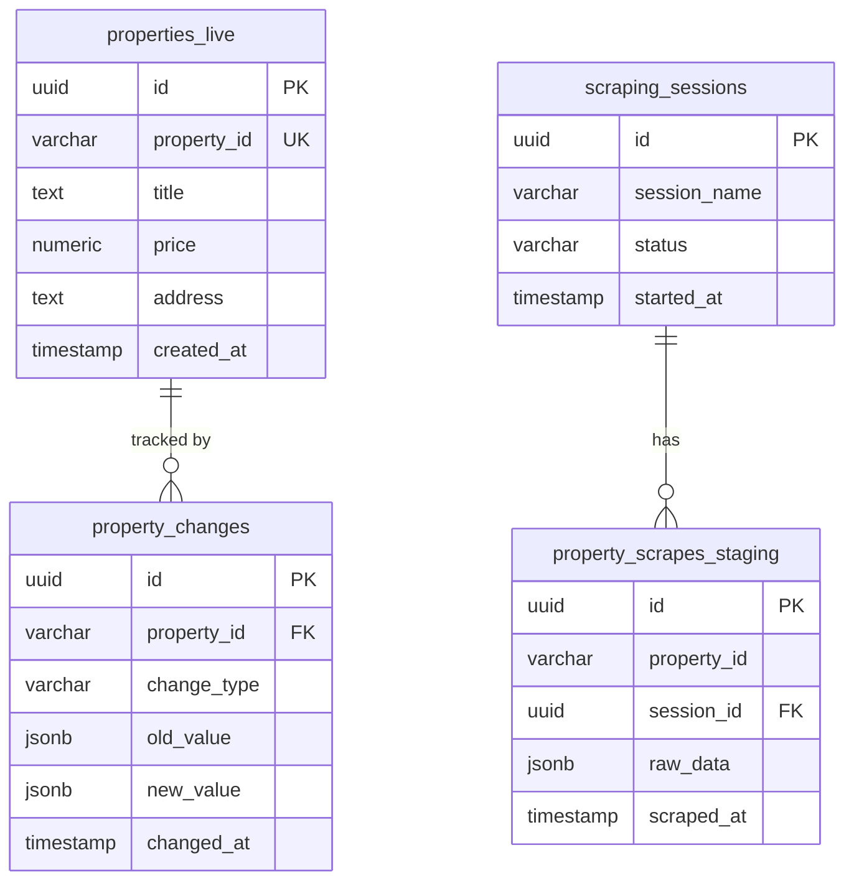

# Database Schema Documentation

**Generated on:** 2025-09-24 12:11:32  
**Database:** Supabase PostgreSQL  
**Project:** PropScraper Property Management System

## Overview

This document contains the complete database schema for the PropScraper system, including all tables, columns, constraints, indexes, and functions.

## Table of Contents

1. [Tables Overview](#tables-overview)
2. [Detailed Table Schemas](#detailed-table-schemas)
3. [Indexes](#indexes)
4. [Functions and Procedures](#functions-and-procedures)
5. [Entity Relationships](#entity-relationships)

## Tables Overview

| Table Name | Type | Columns | Purpose |
|------------|------|---------|---------|
| `chat_conversations` | BASE TABLE | 1 | User chat conversations |
| `chat_messages` | BASE TABLE | 1 | Individual chat messages |
| `properties` | BASE TABLE | 21 | Main properties table (legacy) |
| `properties_live` | BASE TABLE | 54 | Production property data for frontend |
| `property_changes` | BASE TABLE | 10 | Audit log of property modifications |
| `property_scrapes_staging` | BASE TABLE | 50 | Raw scraped data before validation |
| `property_stats` | BASE TABLE | 9 | Materialized view for property statistics |
| `pulled_properties` | BASE TABLE | 58 | Legacy scraped properties storage |
| `scraping_errors` | BASE TABLE | 8 | Log errors during scraping operations |
| `scraping_sessions` | BASE TABLE | 14 | Track scraping job sessions and progress |
| `sync_metadata` | BASE TABLE | 15 | Track data synchronization operations |
| `todo_items` | BASE TABLE | 1 | Task management items |
| `todo_lists` | BASE TABLE | 1 | Task management lists |
| `user_favorites` | BASE TABLE | 1 | User saved/favorite properties |
| `users` | BASE TABLE | 1 | User accounts and profiles |
| `validation_rules` | BASE TABLE | 9 | Configurable data validation rules |

## Detailed Table Schemas

### chat_conversations

**Purpose:** User chat conversations

| Column | Type | Nullable | Default | Constraints |
|--------|------|----------|---------|-------------|
| `id` | `uuid` | ❌ | `-` | 🔑 PRIMARY KEY |

### chat_messages

**Purpose:** Individual chat messages

| Column | Type | Nullable | Default | Constraints |
|--------|------|----------|---------|-------------|
| `id` | `uuid` | ❌ | `-` | 🔑 PRIMARY KEY |

### properties

**Purpose:** Main properties table (legacy)

| Column | Type | Nullable | Default | Constraints |
|--------|------|----------|---------|-------------|
| `id` | `text` | ✅ | `-` | 🔑 PRIMARY KEY |
| `address` | `text` | ✅ | `-` | - |
| `city` | `text` | ✅ | `-` | - |
| `state` | `text` | ✅ | `-` | - |
| `zip_code` | `text` | ✅ | `-` | - |
| `price` | `numeric` | ✅ | `-` | - |
| `bedrooms` | `integer` | ✅ | `-` | - |
| `bathrooms` | `numeric` | ✅ | `-` | - |
| `square_feet` | `integer` | ✅ | `-` | - |
| `property_type` | `text` | ✅ | `-` | - |
| `listing_type` | `text` | ✅ | `-` | - |
| `image_url` | `text` | ✅ | `-` | - |
| `description` | `text` | ✅ | `-` | - |
| `features` | `jsonb` | ✅ | `-` | - |
| `latitude` | `numeric` | ✅ | `-` | - |
| `longitude` | `numeric` | ✅ | `-` | - |
| `year_built` | `integer` | ✅ | `-` | - |
| `parking` | `integer` | ✅ | `-` | - |
| `is_new` | `integer` | ✅ | `-` | - |
| `created_at` | `text` | ✅ | `-` | - |
| `updated_at` | `text` | ✅ | `-` | - |

### properties_live

**Purpose:** Production property data for frontend

| Column | Type | Nullable | Default | Constraints |
|--------|------|----------|---------|-------------|
| `id` | `text` | ✅ | `-` | 🔑 PRIMARY KEY |
| `created_at` | `text` | ✅ | `-` | - |
| `updated_at` | `text` | ✅ | `-` | - |
| `property_id` | `text` | ✅ | `-` | - |
| `title` | `text` | ✅ | `-` | - |
| `description` | `text` | ✅ | `-` | - |
| `property_type` | `text` | ✅ | `-` | - |
| `operation_type` | `text` | ✅ | `-` | - |
| `address` | `text` | ✅ | `-` | - |
| `neighborhood` | `text` | ✅ | `-` | - |
| `city` | `unknown` | ✅ | `-` | - |
| `state` | `text` | ✅ | `-` | - |
| `postal_code` | `unknown` | ✅ | `-` | - |
| `latitude` | `numeric` | ✅ | `-` | - |
| `longitude` | `numeric` | ✅ | `-` | - |
| `gps_coordinates` | `text` | ✅ | `-` | - |
| `price` | `numeric` | ✅ | `-` | - |
| `currency` | `text` | ✅ | `-` | - |
| `price_per_m2` | `unknown` | ✅ | `-` | - |
| `bedrooms` | `integer` | ✅ | `-` | - |
| `bathrooms` | `integer` | ✅ | `-` | - |
| `half_bathrooms` | `unknown` | ✅ | `-` | - |
| `parking_spaces` | `unknown` | ✅ | `-` | - |
| `total_area_m2` | `numeric` | ✅ | `-` | - |
| `covered_area_m2` | `unknown` | ✅ | `-` | - |
| `lot_size_m2` | `unknown` | ✅ | `-` | - |
| `floor_number` | `unknown` | ✅ | `-` | - |
| `total_floors` | `unknown` | ✅ | `-` | - |
| `age_years` | `unknown` | ✅ | `-` | - |
| `construction_year` | `unknown` | ✅ | `-` | - |
| `features` | `jsonb` | ✅ | `-` | - |
| `amenities` | `jsonb` | ✅ | `-` | - |
| `main_image_url` | `text` | ✅ | `-` | - |
| `image_urls` | `jsonb` | ✅ | `-` | - |
| `virtual_tour_url` | `unknown` | ✅ | `-` | - |
| `video_url` | `unknown` | ✅ | `-` | - |
| `agent_name` | `text` | ✅ | `-` | - |
| `agent_phone` | `unknown` | ✅ | `-` | - |
| `agent_email` | `unknown` | ✅ | `-` | - |
| `agency_name` | `text` | ✅ | `-` | - |
| `message_url` | `unknown` | ✅ | `-` | - |
| `is_featured` | `integer` | ✅ | `-` | - |
| `is_premium` | `integer` | ✅ | `-` | - |
| `source_url` | `text` | ✅ | `-` | - |
| `page_number` | `integer` | ✅ | `-` | - |
| `listing_date` | `unknown` | ✅ | `-` | - |
| `scraped_at` | `text` | ✅ | `-` | - |
| `first_seen_at` | `text` | ✅ | `-` | - |
| `last_seen_at` | `text` | ✅ | `-` | - |
| `last_updated_at` | `text` | ✅ | `-` | - |
| `status` | `text` | ✅ | `-` | - |
| `data_completeness_score` | `numeric` | ✅ | `-` | - |
| `verification_status` | `text` | ✅ | `-` | - |
| `search_vector` | `text` | ✅ | `-` | - |

### property_changes

**Purpose:** Audit log of property modifications

| Column | Type | Nullable | Default | Constraints |
|--------|------|----------|---------|-------------|
| `id` | `text` | ✅ | `-` | 🔑 PRIMARY KEY |
| `property_id` | `text` | ✅ | `-` | - |
| `session_id` | `text` | ✅ | `-` | - |
| `change_type` | `text` | ✅ | `-` | - |
| `field_name` | `unknown` | ✅ | `-` | - |
| `old_value` | `unknown` | ✅ | `-` | - |
| `new_value` | `unknown` | ✅ | `-` | - |
| `confidence_score` | `numeric` | ✅ | `-` | - |
| `change_reason` | `text` | ✅ | `-` | - |
| `created_at` | `text` | ✅ | `-` | - |

### property_scrapes_staging

**Purpose:** Raw scraped data before validation

| Column | Type | Nullable | Default | Constraints |
|--------|------|----------|---------|-------------|
| `id` | `text` | ✅ | `-` | 🔑 PRIMARY KEY |
| `session_id` | `text` | ✅ | `-` | - |
| `property_id` | `text` | ✅ | `-` | - |
| `title` | `text` | ✅ | `-` | - |
| `description` | `unknown` | ✅ | `-` | - |
| `property_type` | `text` | ✅ | `-` | - |
| `operation_type` | `text` | ✅ | `-` | - |
| `address` | `text` | ✅ | `-` | - |
| `neighborhood` | `text` | ✅ | `-` | - |
| `city` | `unknown` | ✅ | `-` | - |
| `state` | `unknown` | ✅ | `-` | - |
| `postal_code` | `unknown` | ✅ | `-` | - |
| `latitude` | `numeric` | ✅ | `-` | - |
| `longitude` | `numeric` | ✅ | `-` | - |
| `gps_coordinates` | `text` | ✅ | `-` | - |
| `price` | `numeric` | ✅ | `-` | - |
| `currency` | `text` | ✅ | `-` | - |
| `price_per_m2` | `unknown` | ✅ | `-` | - |
| `bedrooms` | `integer` | ✅ | `-` | - |
| `bathrooms` | `integer` | ✅ | `-` | - |
| `half_bathrooms` | `unknown` | ✅ | `-` | - |
| `parking_spaces` | `unknown` | ✅ | `-` | - |
| `total_area_m2` | `numeric` | ✅ | `-` | - |
| `covered_area_m2` | `unknown` | ✅ | `-` | - |
| `lot_size_m2` | `unknown` | ✅ | `-` | - |
| `floor_number` | `unknown` | ✅ | `-` | - |
| `total_floors` | `unknown` | ✅ | `-` | - |
| `age_years` | `unknown` | ✅ | `-` | - |
| `construction_year` | `unknown` | ✅ | `-` | - |
| `features` | `jsonb` | ✅ | `-` | - |
| `amenities` | `unknown` | ✅ | `-` | - |
| `main_image_url` | `text` | ✅ | `-` | - |
| `image_urls` | `unknown` | ✅ | `-` | - |
| `virtual_tour_url` | `unknown` | ✅ | `-` | - |
| `video_url` | `unknown` | ✅ | `-` | - |
| `agent_name` | `unknown` | ✅ | `-` | - |
| `agent_phone` | `unknown` | ✅ | `-` | - |
| `agent_email` | `unknown` | ✅ | `-` | - |
| `agency_name` | `unknown` | ✅ | `-` | - |
| `message_url` | `unknown` | ✅ | `-` | - |
| `status` | `text` | ✅ | `-` | - |
| `is_featured` | `integer` | ✅ | `-` | - |
| `is_premium` | `integer` | ✅ | `-` | - |
| `source_url` | `text` | ✅ | `-` | - |
| `page_number` | `integer` | ✅ | `-` | - |
| `listing_date` | `unknown` | ✅ | `-` | - |
| `scraped_at` | `text` | ✅ | `-` | - |
| `processing_status` | `text` | ✅ | `-` | - |
| `change_type` | `text` | ✅ | `-` | - |
| `created_at` | `text` | ✅ | `-` | - |

### property_stats

**Purpose:** Materialized view for property statistics

| Column | Type | Nullable | Default | Constraints |
|--------|------|----------|---------|-------------|
| `property_type` | `text` | ✅ | `-` | - |
| `operation_type` | `text` | ✅ | `-` | - |
| `city` | `text` | ✅ | `-` | - |
| `total_count` | `integer` | ✅ | `-` | - |
| `avg_price` | `numeric` | ✅ | `-` | - |
| `min_price` | `numeric` | ✅ | `-` | - |
| `max_price` | `numeric` | ✅ | `-` | - |
| `avg_area` | `unknown` | ✅ | `-` | - |
| `active_count` | `integer` | ✅ | `-` | - |

### pulled_properties

**Purpose:** Legacy scraped properties storage

| Column | Type | Nullable | Default | Constraints |
|--------|------|----------|---------|-------------|
| `id` | `text` | ✅ | `-` | 🔑 PRIMARY KEY |
| `created_at` | `text` | ✅ | `-` | - |
| `updated_at` | `text` | ✅ | `-` | - |
| `property_id` | `text` | ✅ | `-` | - |
| `title` | `text` | ✅ | `-` | - |
| `description` | `text` | ✅ | `-` | - |
| `property_type` | `text` | ✅ | `-` | - |
| `operation_type` | `text` | ✅ | `-` | - |
| `address` | `text` | ✅ | `-` | - |
| `neighborhood` | `text` | ✅ | `-` | - |
| `city` | `unknown` | ✅ | `-` | - |
| `state` | `text` | ✅ | `-` | - |
| `postal_code` | `unknown` | ✅ | `-` | - |
| `latitude` | `numeric` | ✅ | `-` | - |
| `longitude` | `numeric` | ✅ | `-` | - |
| `price` | `numeric` | ✅ | `-` | - |
| `currency` | `text` | ✅ | `-` | - |
| `price_per_m2` | `unknown` | ✅ | `-` | - |
| `bedrooms` | `integer` | ✅ | `-` | - |
| `bathrooms` | `integer` | ✅ | `-` | - |
| `half_bathrooms` | `unknown` | ✅ | `-` | - |
| `parking_spaces` | `unknown` | ✅ | `-` | - |
| `total_area_m2` | `numeric` | ✅ | `-` | - |
| `covered_area_m2` | `unknown` | ✅ | `-` | - |
| `lot_size_m2` | `unknown` | ✅ | `-` | - |
| `floor_number` | `unknown` | ✅ | `-` | - |
| `total_floors` | `unknown` | ✅ | `-` | - |
| `age_years` | `unknown` | ✅ | `-` | - |
| `construction_year` | `unknown` | ✅ | `-` | - |
| `features` | `jsonb` | ✅ | `-` | - |
| `amenities` | `jsonb` | ✅ | `-` | - |
| `main_image_url` | `text` | ✅ | `-` | - |
| `image_urls` | `jsonb` | ✅ | `-` | - |
| `virtual_tour_url` | `unknown` | ✅ | `-` | - |
| `video_url` | `unknown` | ✅ | `-` | - |
| `agent_name` | `text` | ✅ | `-` | - |
| `agent_phone` | `unknown` | ✅ | `-` | - |
| `agent_email` | `unknown` | ✅ | `-` | - |
| `agency_name` | `text` | ✅ | `-` | - |
| `status` | `text` | ✅ | `-` | - |
| `is_featured` | `integer` | ✅ | `-` | - |
| `is_premium` | `integer` | ✅ | `-` | - |
| `source_url` | `text` | ✅ | `-` | - |
| `scraped_at` | `text` | ✅ | `-` | - |
| `page_number` | `integer` | ✅ | `-` | - |
| `listing_date` | `unknown` | ✅ | `-` | - |
| `has_pool` | `integer` | ✅ | `-` | - |
| `has_garden` | `integer` | ✅ | `-` | - |
| `has_elevator` | `integer` | ✅ | `-` | - |
| `has_balcony` | `integer` | ✅ | `-` | - |
| `has_terrace` | `integer` | ✅ | `-` | - |
| `has_gym` | `integer` | ✅ | `-` | - |
| `has_security` | `integer` | ✅ | `-` | - |
| `pet_friendly` | `integer` | ✅ | `-` | - |
| `furnished` | `integer` | ✅ | `-` | - |
| `search_vector` | `text` | ✅ | `-` | - |
| `gps_coordinates` | `text` | ✅ | `-` | - |
| `message_url` | `unknown` | ✅ | `-` | - |

### scraping_errors

**Purpose:** Log errors during scraping operations

| Column | Type | Nullable | Default | Constraints |
|--------|------|----------|---------|-------------|
| `id` | `text` | ✅ | `-` | 🔑 PRIMARY KEY |
| `created_at` | `text` | ✅ | `-` | - |
| `session_id` | `text` | ✅ | `-` | - |
| `url` | `text` | ✅ | `-` | - |
| `error_type` | `text` | ✅ | `-` | - |
| `error_message` | `text` | ✅ | `-` | - |
| `retry_count` | `integer` | ✅ | `-` | - |
| `resolved` | `integer` | ✅ | `-` | - |

### scraping_sessions

**Purpose:** Track scraping job sessions and progress

| Column | Type | Nullable | Default | Constraints |
|--------|------|----------|---------|-------------|
| `id` | `text` | ✅ | `-` | 🔑 PRIMARY KEY |
| `created_at` | `text` | ✅ | `-` | - |
| `session_name` | `text` | ✅ | `-` | - |
| `base_url` | `text` | ✅ | `-` | - |
| `total_pages` | `integer` | ✅ | `-` | - |
| `pages_scraped` | `integer` | ✅ | `-` | - |
| `properties_found` | `integer` | ✅ | `-` | - |
| `properties_inserted` | `integer` | ✅ | `-` | - |
| `properties_updated` | `integer` | ✅ | `-` | - |
| `status` | `text` | ✅ | `-` | - |
| `error_message` | `unknown` | ✅ | `-` | - |
| `started_at` | `text` | ✅ | `-` | - |
| `completed_at` | `unknown` | ✅ | `-` | - |
| `filters_applied` | `jsonb` | ✅ | `-` | - |

### sync_metadata

**Purpose:** Track data synchronization operations

| Column | Type | Nullable | Default | Constraints |
|--------|------|----------|---------|-------------|
| `id` | `text` | ✅ | `-` | 🔑 PRIMARY KEY |
| `session_id` | `text` | ✅ | `-` | - |
| `total_scraped` | `integer` | ✅ | `-` | - |
| `new_properties` | `integer` | ✅ | `-` | - |
| `updated_properties` | `integer` | ✅ | `-` | - |
| `removed_properties` | `integer` | ✅ | `-` | - |
| `unchanged_properties` | `integer` | ✅ | `-` | - |
| `data_quality_score` | `numeric` | ✅ | `-` | - |
| `completeness_rate` | `numeric` | ✅ | `-` | - |
| `sync_duration_ms` | `integer` | ✅ | `-` | - |
| `staging_to_live_duration_ms` | `integer` | ✅ | `-` | - |
| `sync_status` | `text` | ✅ | `-` | - |
| `error_summary` | `unknown` | ✅ | `-` | - |
| `created_at` | `text` | ✅ | `-` | - |
| `completed_at` | `text` | ✅ | `-` | - |

### todo_items

**Purpose:** Task management items

| Column | Type | Nullable | Default | Constraints |
|--------|------|----------|---------|-------------|
| `id` | `uuid` | ❌ | `-` | 🔑 PRIMARY KEY |

### todo_lists

**Purpose:** Task management lists

| Column | Type | Nullable | Default | Constraints |
|--------|------|----------|---------|-------------|
| `id` | `uuid` | ❌ | `-` | 🔑 PRIMARY KEY |

### user_favorites

**Purpose:** User saved/favorite properties

| Column | Type | Nullable | Default | Constraints |
|--------|------|----------|---------|-------------|
| `id` | `uuid` | ❌ | `-` | 🔑 PRIMARY KEY |

### users

**Purpose:** User accounts and profiles

| Column | Type | Nullable | Default | Constraints |
|--------|------|----------|---------|-------------|
| `id` | `uuid` | ❌ | `-` | 🔑 PRIMARY KEY |

### validation_rules

**Purpose:** Configurable data validation rules

| Column | Type | Nullable | Default | Constraints |
|--------|------|----------|---------|-------------|
| `id` | `text` | ✅ | `-` | 🔑 PRIMARY KEY |
| `rule_name` | `text` | ✅ | `-` | - |
| `field_name` | `text` | ✅ | `-` | - |
| `rule_type` | `text` | ✅ | `-` | - |
| `rule_config` | `jsonb` | ✅ | `-` | - |
| `severity` | `text` | ✅ | `-` | - |
| `is_active` | `integer` | ✅ | `-` | - |
| `created_at` | `text` | ✅ | `-` | - |
| `updated_at` | `text` | ✅ | `-` | - |

## Entity Relationships

### Primary Relationships

### Key Relationships

1. **Scraping Sessions → Staging Data**
   - One session can have many scraped properties
   - Used to track and batch process scraped data

2. **Staging → Live Properties** 
   - Data flows from staging to live after validation
   - Change detection compares these tables

3. **Properties → Change Log**
   - All property modifications are tracked
   - Provides complete audit trail

4. **Validation Rules → Data Quality**
   - Configurable rules validate staging data
   - Ensures data quality before promotion

## Additional Notes

### Data Types Used
- `uuid` - Universally Unique Identifiers for primary keys
- `text` - Variable-length text strings
- `varchar(n)` - Variable-length strings with maximum length
- `integer` - 32-bit integers
- `numeric` - Arbitrary precision numbers
- `boolean` - True/false values
- `timestamp` - Date and time values
- `jsonb` - Binary JSON data (indexed)
- `real` - Single precision floating-point

### Naming Conventions
- Table names use snake_case
- Primary keys are typically named `id`
- Foreign keys follow the pattern `{table}_id`
- Timestamp columns use `created_at` and `updated_at`
- Boolean columns often use `is_` prefix

### Performance Considerations
- All tables have UUID primary keys for distributed scaling
- Indexes are created on frequently queried columns
- JSONB columns are used for flexible schema requirements
- Full-text search is implemented using PostgreSQL's built-in capabilities

### Security
- Row Level Security (RLS) may be enabled on sensitive tables
- Access is controlled through Supabase policies
- API access is managed through service keys

---

*This documentation was automatically generated from the live database schema.*
