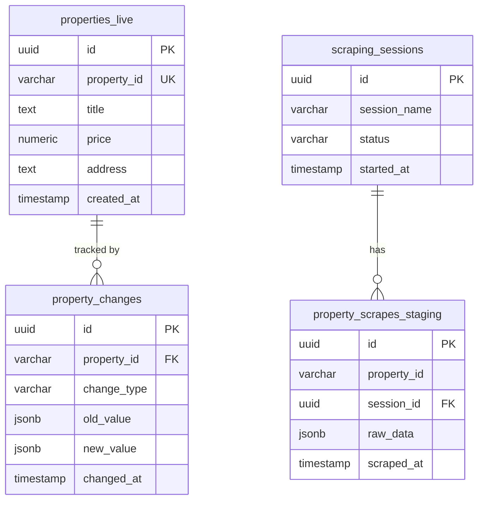

# Database Schema Documentation

**Generated on:** 2025-12-29 14:35:14  
**Database:** Supabase PostgreSQL  
**Project:** PropScraper Property Management System

## Overview

This document contains the complete database schema for the PropScraper system, including all tables, columns, constraints, indexes, and functions.

## Table of Contents

1. [Tables Overview](#tables-overview)
2. [Detailed Table Schemas](#detailed-table-schemas)
3. [Indexes](#indexes)
4. [Functions and Procedures](#functions-and-procedures)
5. [Entity Relationships](#entity-relationships)

## Tables Overview

| Table Name | Type | Columns | Purpose |
|------------|------|---------|---------|

## Detailed Table Schemas

## Indexes

| Table | Index Name | Definition |
|-------|------------|------------|
| `action_plan_steps` | `action_plan_steps_pkey` | `CREATE UNIQUE INDEX action_plan_steps_pkey ON public.action_plan_steps USING btree (id)` |
| `action_plan_steps` | `idx_action_plan_steps_order` | `CREATE INDEX idx_action_plan_steps_order ON public.action_plan_steps USING btree (plan_id, order_index)` |
| `action_plan_steps` | `idx_action_plan_steps_plan_id` | `CREATE INDEX idx_action_plan_steps_plan_id ON public.action_plan_steps USING btree (plan_id)` |
| `action_plans` | `action_plans_pkey` | `CREATE UNIQUE INDEX action_plans_pkey ON public.action_plans USING btree (id)` |
| `action_plans` | `idx_action_plans_status` | `CREATE INDEX idx_action_plans_status ON public.action_plans USING btree (status)` |
| `action_plans` | `idx_action_plans_user_id` | `CREATE INDEX idx_action_plans_user_id ON public.action_plans USING btree (user_id)` |
| `agency_accounts` | `agency_accounts_email_key` | `CREATE UNIQUE INDEX agency_accounts_email_key ON public.agency_accounts USING btree (email)` |
| `agency_accounts` | `agency_accounts_pkey` | `CREATE UNIQUE INDEX agency_accounts_pkey ON public.agency_accounts USING btree (id)` |
| `agency_accounts` | `idx_agency_accounts_active` | `CREATE INDEX idx_agency_accounts_active ON public.agency_accounts USING btree (is_active) WHERE (is_active = true)` |
| `agency_accounts` | `idx_agency_accounts_created_at` | `CREATE INDEX idx_agency_accounts_created_at ON public.agency_accounts USING btree (created_at)` |
| `agency_accounts` | `idx_agency_accounts_email` | `CREATE INDEX idx_agency_accounts_email ON public.agency_accounts USING btree (email)` |
| `agency_accounts` | `idx_agency_accounts_last_login` | `CREATE INDEX idx_agency_accounts_last_login ON public.agency_accounts USING btree (last_login_at)` |
| `agency_sessions` | `agency_sessions_pkey` | `CREATE UNIQUE INDEX agency_sessions_pkey ON public.agency_sessions USING btree (id)` |
| `agency_sessions` | `agency_sessions_session_token_key` | `CREATE UNIQUE INDEX agency_sessions_session_token_key ON public.agency_sessions USING btree (session_token)` |
| `agency_sessions` | `idx_agency_sessions_agency_id` | `CREATE INDEX idx_agency_sessions_agency_id ON public.agency_sessions USING btree (agency_id)` |
| `agency_sessions` | `idx_agency_sessions_expires` | `CREATE INDEX idx_agency_sessions_expires ON public.agency_sessions USING btree (expires_at)` |
| `agency_sessions` | `idx_agency_sessions_token` | `CREATE INDEX idx_agency_sessions_token ON public.agency_sessions USING btree (session_token)` |
| `agent_interactions` | `agent_interactions_pkey` | `CREATE UNIQUE INDEX agent_interactions_pkey ON public.agent_interactions USING btree (id)` |
| `agent_interactions` | `idx_agent_interactions_property_id` | `CREATE INDEX idx_agent_interactions_property_id ON public.agent_interactions USING btree (property_id)` |
| `agent_interactions` | `idx_agent_interactions_type` | `CREATE INDEX idx_agent_interactions_type ON public.agent_interactions USING btree (interaction_type)` |
| `agent_interactions` | `idx_agent_interactions_user_id` | `CREATE INDEX idx_agent_interactions_user_id ON public.agent_interactions USING btree (user_id)` |
| `chat_conversations` | `chat_conversations_pkey` | `CREATE UNIQUE INDEX chat_conversations_pkey ON public.chat_conversations USING btree (id)` |
| `chat_messages` | `chat_messages_pkey` | `CREATE UNIQUE INDEX chat_messages_pkey ON public.chat_messages USING btree (id)` |
| `chat_messages` | `idx_chat_messages_conversation_id` | `CREATE INDEX idx_chat_messages_conversation_id ON public.chat_messages USING btree (conversation_id)` |
| `conversation_metadata` | `conversation_metadata_pkey` | `CREATE UNIQUE INDEX conversation_metadata_pkey ON public.conversation_metadata USING btree (id)` |
| `conversation_metadata` | `idx_conversation_metadata_context` | `CREATE INDEX idx_conversation_metadata_context ON public.conversation_metadata USING gin (context)` |
| `conversation_metadata` | `idx_conversation_metadata_conversation_id` | `CREATE INDEX idx_conversation_metadata_conversation_id ON public.conversation_metadata USING btree (conversation_id)` |
| `conversation_metadata` | `idx_conversation_metadata_user_id` | `CREATE INDEX idx_conversation_metadata_user_id ON public.conversation_metadata USING btree (user_id)` |
| `easybroker_accounts` | `easybroker_accounts_account_name_key` | `CREATE UNIQUE INDEX easybroker_accounts_account_name_key ON public.easybroker_accounts USING btree (account_name)` |
| `easybroker_accounts` | `easybroker_accounts_pkey` | `CREATE UNIQUE INDEX easybroker_accounts_pkey ON public.easybroker_accounts USING btree (id)` |
| `easybroker_accounts` | `idx_easybroker_accounts_active` | `CREATE INDEX idx_easybroker_accounts_active ON public.easybroker_accounts USING btree (is_active, last_sync_at)` |
| `easybroker_accounts` | `idx_easybroker_accounts_agency_account_id` | `CREATE INDEX idx_easybroker_accounts_agency_account_id ON public.easybroker_accounts USING btree (agency_account_id)` |
| `easybroker_accounts` | `idx_easybroker_accounts_user_id` | `CREATE INDEX idx_easybroker_accounts_user_id ON public.easybroker_accounts USING btree (user_id)` |
| `easybroker_properties_staging` | `easybroker_properties_staging_pkey` | `CREATE UNIQUE INDEX easybroker_properties_staging_pkey ON public.easybroker_properties_staging USING btree (id)` |
| `easybroker_properties_staging` | `easybroker_properties_staging_session_id_public_id_key` | `CREATE UNIQUE INDEX easybroker_properties_staging_session_id_public_id_key ON public.easybroker_properties_staging USING btree (session_id, public_id)` |
| `easybroker_properties_staging` | `idx_easybroker_staging_account_id` | `CREATE INDEX idx_easybroker_staging_account_id ON public.easybroker_properties_staging USING btree (account_id)` |
| `easybroker_properties_staging` | `idx_easybroker_staging_features` | `CREATE INDEX idx_easybroker_staging_features ON public.easybroker_properties_staging USING gin (features)` |
| `easybroker_properties_staging` | `idx_easybroker_staging_processing_status` | `CREATE INDEX idx_easybroker_staging_processing_status ON public.easybroker_properties_staging USING btree (processing_status)` |
| `easybroker_properties_staging` | `idx_easybroker_staging_public_id` | `CREATE INDEX idx_easybroker_staging_public_id ON public.easybroker_properties_staging USING btree (public_id)` |
| `easybroker_properties_staging` | `idx_easybroker_staging_scraped_at` | `CREATE INDEX idx_easybroker_staging_scraped_at ON public.easybroker_properties_staging USING btree (scraped_at)` |
| `easybroker_properties_staging` | `idx_easybroker_staging_session_id` | `CREATE INDEX idx_easybroker_staging_session_id ON public.easybroker_properties_staging USING btree (session_id)` |
| `easybroker_property_mappings` | `easybroker_property_mappings_account_id_easybroker_public_i_key` | `CREATE UNIQUE INDEX easybroker_property_mappings_account_id_easybroker_public_i_key ON public.easybroker_property_mappings USING btree (account_id, easybroker_public_id)` |
| `easybroker_property_mappings` | `easybroker_property_mappings_pkey` | `CREATE UNIQUE INDEX easybroker_property_mappings_pkey ON public.easybroker_property_mappings USING btree (id)` |
| `easybroker_property_mappings` | `easybroker_property_mappings_property_id_key` | `CREATE UNIQUE INDEX easybroker_property_mappings_property_id_key ON public.easybroker_property_mappings USING btree (property_id)` |
| `easybroker_property_mappings` | `idx_easybroker_mappings_account_id` | `CREATE INDEX idx_easybroker_mappings_account_id ON public.easybroker_property_mappings USING btree (account_id)` |
| `easybroker_property_mappings` | `idx_easybroker_mappings_is_active` | `CREATE INDEX idx_easybroker_mappings_is_active ON public.easybroker_property_mappings USING btree (is_active)` |
| `easybroker_property_mappings` | `idx_easybroker_mappings_property_id` | `CREATE INDEX idx_easybroker_mappings_property_id ON public.easybroker_property_mappings USING btree (property_id)` |
| `easybroker_property_mappings` | `idx_easybroker_mappings_public_id` | `CREATE INDEX idx_easybroker_mappings_public_id ON public.easybroker_property_mappings USING btree (easybroker_public_id)` |
| `easybroker_sync_metadata` | `easybroker_sync_metadata_pkey` | `CREATE UNIQUE INDEX easybroker_sync_metadata_pkey ON public.easybroker_sync_metadata USING btree (id)` |
| `easybroker_sync_metadata` | `idx_easybroker_sync_account_id` | `CREATE INDEX idx_easybroker_sync_account_id ON public.easybroker_sync_metadata USING btree (account_id)` |
| `easybroker_sync_metadata` | `idx_easybroker_sync_created_at` | `CREATE INDEX idx_easybroker_sync_created_at ON public.easybroker_sync_metadata USING btree (created_at)` |
| `easybroker_sync_metadata` | `idx_easybroker_sync_session_id` | `CREATE INDEX idx_easybroker_sync_session_id ON public.easybroker_sync_metadata USING btree (session_id)` |
| `easybroker_sync_metadata` | `idx_easybroker_sync_status` | `CREATE INDEX idx_easybroker_sync_status ON public.easybroker_sync_metadata USING btree (sync_status)` |
| `journey_step_transitions` | `idx_journey_transitions_plan_id` | `CREATE INDEX idx_journey_transitions_plan_id ON public.journey_step_transitions USING btree (action_plan_id)` |
| `journey_step_transitions` | `idx_journey_transitions_user_id` | `CREATE INDEX idx_journey_transitions_user_id ON public.journey_step_transitions USING btree (user_id)` |
| `journey_step_transitions` | `journey_step_transitions_pkey` | `CREATE UNIQUE INDEX journey_step_transitions_pkey ON public.journey_step_transitions USING btree (id)` |
| `playlist_properties` | `idx_playlist_properties_playlist_id` | `CREATE INDEX idx_playlist_properties_playlist_id ON public.playlist_properties USING btree (playlist_id)` |
| `playlist_properties` | `idx_playlist_properties_property_id` | `CREATE INDEX idx_playlist_properties_property_id ON public.playlist_properties USING btree (property_id)` |
| `playlist_properties` | `playlist_properties_pkey` | `CREATE UNIQUE INDEX playlist_properties_pkey ON public.playlist_properties USING btree (id)` |
| `playlist_properties` | `playlist_properties_playlist_id_property_id_key` | `CREATE UNIQUE INDEX playlist_properties_playlist_id_property_id_key ON public.playlist_properties USING btree (playlist_id, property_id)` |
| `playlists` | `idx_playlists_is_default` | `CREATE INDEX idx_playlists_is_default ON public.playlists USING btree (is_default)` |
| `playlists` | `idx_playlists_user_id` | `CREATE INDEX idx_playlists_user_id ON public.playlists USING btree (user_id)` |
| `playlists` | `playlists_pkey` | `CREATE UNIQUE INDEX playlists_pkey ON public.playlists USING btree (id)` |
| `properties` | `idx_properties_bathrooms` | `CREATE INDEX idx_properties_bathrooms ON public.properties USING btree (bathrooms)` |
| `properties` | `idx_properties_bedrooms` | `CREATE INDEX idx_properties_bedrooms ON public.properties USING btree (bedrooms)` |
| `properties` | `idx_properties_city` | `CREATE INDEX idx_properties_city ON public.properties USING btree (city)` |
| `properties` | `idx_properties_listing_type` | `CREATE INDEX idx_properties_listing_type ON public.properties USING btree (listing_type)` |
| `properties` | `idx_properties_location` | `CREATE INDEX idx_properties_location ON public.properties USING btree (latitude, longitude)` |
| `properties` | `idx_properties_price` | `CREATE INDEX idx_properties_price ON public.properties USING btree (price)` |
| `properties` | `idx_properties_property_type` | `CREATE INDEX idx_properties_property_type ON public.properties USING btree (property_type)` |
| `properties` | `idx_properties_state` | `CREATE INDEX idx_properties_state ON public.properties USING btree (state)` |
| `properties` | `properties_pkey` | `CREATE UNIQUE INDEX properties_pkey ON public.properties USING btree (id)` |
| `properties_live` | `idx_live_listing_status` | `CREATE INDEX idx_live_listing_status ON public.properties_live USING btree (listing_status)` |
| `properties_live` | `idx_live_manifest_check` | `CREATE INDEX idx_live_manifest_check ON public.properties_live USING btree (property_id, last_manifest_seen_at)` |
| `properties_live` | `idx_live_missing_count` | `CREATE INDEX idx_live_missing_count ON public.properties_live USING btree (consecutive_missing_count) WHERE (((listing_status)::text = 'active'::text) AND (consecutive_missing_count > 0))` |
| `properties_live` | `idx_live_priority` | `CREATE INDEX idx_live_priority ON public.properties_live USING btree (scrape_priority) WHERE ((listing_status)::text = 'active'::text)` |
| `properties_live` | `idx_live_stale` | `CREATE INDEX idx_live_stale ON public.properties_live USING btree (last_full_scrape_at) WHERE ((listing_status)::text = 'active'::text)` |
| `properties_live` | `idx_properties_active` | `CREATE INDEX idx_properties_active ON public.properties_live USING btree (last_updated_at) WHERE ((status)::text = 'active'::text)` |
| `properties_live` | `idx_properties_live_amenities` | `CREATE INDEX idx_properties_live_amenities ON public.properties_live USING gin (amenities)` |
| `properties_live` | `idx_properties_live_bedrooms` | `CREATE INDEX idx_properties_live_bedrooms ON public.properties_live USING btree (bedrooms)` |
| `properties_live` | `idx_properties_live_city` | `CREATE INDEX idx_properties_live_city ON public.properties_live USING btree (city)` |
| `properties_live` | `idx_properties_live_last_updated` | `CREATE INDEX idx_properties_live_last_updated ON public.properties_live USING btree (last_updated_at)` |
| `properties_live` | `idx_properties_live_location` | `CREATE INDEX idx_properties_live_location ON public.properties_live USING btree (latitude, longitude) WHERE ((latitude IS NOT NULL) AND (longitude IS NOT NULL))` |
| `properties_live` | `idx_properties_live_neighborhood` | `CREATE INDEX idx_properties_live_neighborhood ON public.properties_live USING btree (neighborhood)` |
| `properties_live` | `idx_properties_live_operation_type` | `CREATE INDEX idx_properties_live_operation_type ON public.properties_live USING btree (operation_type)` |
| `properties_live` | `idx_properties_live_price` | `CREATE INDEX idx_properties_live_price ON public.properties_live USING btree (price)` |
| `properties_live` | `idx_properties_live_property_type` | `CREATE INDEX idx_properties_live_property_type ON public.properties_live USING btree (property_type)` |
| `properties_live` | `idx_properties_live_search` | `CREATE INDEX idx_properties_live_search ON public.properties_live USING gin (search_vector)` |
| `properties_live` | `idx_properties_live_status` | `CREATE INDEX idx_properties_live_status ON public.properties_live USING btree (status)` |
| `properties_live` | `properties_live_pkey` | `CREATE UNIQUE INDEX properties_live_pkey ON public.properties_live USING btree (id)` |
| `properties_live` | `properties_live_property_id_key` | `CREATE UNIQUE INDEX properties_live_property_id_key ON public.properties_live USING btree (property_id)` |
| `property_changes` | `idx_property_changes_created_at` | `CREATE INDEX idx_property_changes_created_at ON public.property_changes USING btree (created_at)` |
| `property_changes` | `idx_property_changes_property_id` | `CREATE INDEX idx_property_changes_property_id ON public.property_changes USING btree (property_id)` |
| `property_changes` | `idx_property_changes_session_id` | `CREATE INDEX idx_property_changes_session_id ON public.property_changes USING btree (session_id)` |
| `property_changes` | `idx_property_changes_type` | `CREATE INDEX idx_property_changes_type ON public.property_changes USING btree (change_type)` |
| `property_changes` | `property_changes_pkey` | `CREATE UNIQUE INDEX property_changes_pkey ON public.property_changes USING btree (id)` |
| `property_manifest` | `idx_manifest_is_new` | `CREATE INDEX idx_manifest_is_new ON public.property_manifest USING btree (is_new) WHERE (is_new = true)` |
| `property_manifest` | `idx_manifest_last_seen` | `CREATE INDEX idx_manifest_last_seen ON public.property_manifest USING btree (last_seen_at)` |
| `property_manifest` | `idx_manifest_needs_scrape` | `CREATE INDEX idx_manifest_needs_scrape ON public.property_manifest USING btree (needs_full_scrape) WHERE (needs_full_scrape = true)` |
| `property_manifest` | `idx_manifest_price_changed` | `CREATE INDEX idx_manifest_price_changed ON public.property_manifest USING btree (price_changed) WHERE (price_changed = true)` |
| `property_manifest` | `idx_manifest_property_id` | `CREATE INDEX idx_manifest_property_id ON public.property_manifest USING btree (property_id)` |
| `property_manifest` | `idx_manifest_session` | `CREATE INDEX idx_manifest_session ON public.property_manifest USING btree (seen_in_session_id)` |
| `property_manifest` | `property_manifest_pkey` | `CREATE UNIQUE INDEX property_manifest_pkey ON public.property_manifest USING btree (id)` |
| `property_manifest` | `property_manifest_property_id_key` | `CREATE UNIQUE INDEX property_manifest_property_id_key ON public.property_manifest USING btree (property_id)` |
| `property_scrapes_staging` | `idx_staging_change_type` | `CREATE INDEX idx_staging_change_type ON public.property_scrapes_staging USING btree (change_type)` |
| `property_scrapes_staging` | `idx_staging_property_id` | `CREATE INDEX idx_staging_property_id ON public.property_scrapes_staging USING btree (property_id)` |
| `property_scrapes_staging` | `idx_staging_scraped_at` | `CREATE INDEX idx_staging_scraped_at ON public.property_scrapes_staging USING btree (scraped_at)` |
| `property_scrapes_staging` | `idx_staging_session_status` | `CREATE INDEX idx_staging_session_status ON public.property_scrapes_staging USING btree (session_id, processing_status)` |
| `property_scrapes_staging` | `property_scrapes_staging_pkey` | `CREATE UNIQUE INDEX property_scrapes_staging_pkey ON public.property_scrapes_staging USING btree (id)` |
| `property_scrapes_staging` | `unique_property_per_session` | `CREATE UNIQUE INDEX unique_property_per_session ON public.property_scrapes_staging USING btree (session_id, property_id)` |
| `property_showing_requests` | `idx_showing_requests_agent_phone` | `CREATE INDEX idx_showing_requests_agent_phone ON public.property_showing_requests USING btree (agent_phone)` |
| `property_showing_requests` | `idx_showing_requests_agent_responded` | `CREATE INDEX idx_showing_requests_agent_responded ON public.property_showing_requests USING btree (agent_responded_at) WHERE (agent_responded_at IS NOT NULL)` |
| `property_showing_requests` | `idx_showing_requests_interaction` | `CREATE INDEX idx_showing_requests_interaction ON public.property_showing_requests USING btree (interaction_id) WHERE (interaction_id IS NOT NULL)` |
| `property_showing_requests` | `idx_showing_requests_property` | `CREATE INDEX idx_showing_requests_property ON public.property_showing_requests USING btree (property_id)` |
| `property_showing_requests` | `idx_showing_requests_scheduled` | `CREATE INDEX idx_showing_requests_scheduled ON public.property_showing_requests USING btree (scheduled_at) WHERE ((scheduled_at IS NOT NULL) AND (status = ANY (ARRAY['scheduled'::showing_request_status, 'completed'::showing_request_status])))` |
| `property_showing_requests` | `idx_showing_requests_user_status` | `CREATE INDEX idx_showing_requests_user_status ON public.property_showing_requests USING btree (user_id, status)` |
| `property_showing_requests` | `property_showing_requests_pkey` | `CREATE UNIQUE INDEX property_showing_requests_pkey ON public.property_showing_requests USING btree (id)` |
| `property_stats` | `property_stats_unique_idx` | `CREATE UNIQUE INDEX property_stats_unique_idx ON public.property_stats USING btree (property_type, operation_type, city)` |
| `pulled_properties` | `idx_pulled_properties_amenities` | `CREATE INDEX idx_pulled_properties_amenities ON public.pulled_properties USING gin (amenities)` |
| `pulled_properties` | `idx_pulled_properties_bedrooms` | `CREATE INDEX idx_pulled_properties_bedrooms ON public.pulled_properties USING btree (bedrooms)` |
| `pulled_properties` | `idx_pulled_properties_city` | `CREATE INDEX idx_pulled_properties_city ON public.pulled_properties USING btree (city)` |
| `pulled_properties` | `idx_pulled_properties_latitude` | `CREATE INDEX idx_pulled_properties_latitude ON public.pulled_properties USING btree (latitude) WHERE (latitude IS NOT NULL)` |
| `pulled_properties` | `idx_pulled_properties_longitude` | `CREATE INDEX idx_pulled_properties_longitude ON public.pulled_properties USING btree (longitude) WHERE (longitude IS NOT NULL)` |
| `pulled_properties` | `idx_pulled_properties_neighborhood` | `CREATE INDEX idx_pulled_properties_neighborhood ON public.pulled_properties USING btree (neighborhood)` |
| `pulled_properties` | `idx_pulled_properties_operation_type` | `CREATE INDEX idx_pulled_properties_operation_type ON public.pulled_properties USING btree (operation_type)` |
| `pulled_properties` | `idx_pulled_properties_price` | `CREATE INDEX idx_pulled_properties_price ON public.pulled_properties USING btree (price)` |
| `pulled_properties` | `idx_pulled_properties_property_type` | `CREATE INDEX idx_pulled_properties_property_type ON public.pulled_properties USING btree (property_type)` |
| `pulled_properties` | `idx_pulled_properties_scraped_at` | `CREATE INDEX idx_pulled_properties_scraped_at ON public.pulled_properties USING btree (scraped_at)` |
| `pulled_properties` | `idx_pulled_properties_search` | `CREATE INDEX idx_pulled_properties_search ON public.pulled_properties USING gin (search_vector)` |
| `pulled_properties` | `idx_pulled_properties_status` | `CREATE INDEX idx_pulled_properties_status ON public.pulled_properties USING btree (status)` |
| `pulled_properties` | `pulled_properties_pkey` | `CREATE UNIQUE INDEX pulled_properties_pkey ON public.pulled_properties USING btree (id)` |
| `pulled_properties` | `pulled_properties_property_id_key` | `CREATE UNIQUE INDEX pulled_properties_property_id_key ON public.pulled_properties USING btree (property_id)` |
| `scrape_queue` | `idx_queue_claimed` | `CREATE INDEX idx_queue_claimed ON public.scrape_queue USING btree (claimed_at) WHERE ((status)::text = 'in_progress'::text)` |
| `scrape_queue` | `idx_queue_pending` | `CREATE INDEX idx_queue_pending ON public.scrape_queue USING btree (priority, queued_at) WHERE ((status)::text = 'pending'::text)` |
| `scrape_queue` | `idx_queue_property` | `CREATE INDEX idx_queue_property ON public.scrape_queue USING btree (property_id)` |
| `scrape_queue` | `idx_queue_session` | `CREATE INDEX idx_queue_session ON public.scrape_queue USING btree (session_id)` |
| `scrape_queue` | `idx_queue_status` | `CREATE INDEX idx_queue_status ON public.scrape_queue USING btree (status)` |
| `scrape_queue` | `idx_queue_unique_pending` | `CREATE UNIQUE INDEX idx_queue_unique_pending ON public.scrape_queue USING btree (property_id) WHERE ((status)::text = 'pending'::text)` |
| `scrape_queue` | `scrape_queue_pkey` | `CREATE UNIQUE INDEX scrape_queue_pkey ON public.scrape_queue USING btree (id)` |
| `scraping_errors` | `scraping_errors_pkey` | `CREATE UNIQUE INDEX scraping_errors_pkey ON public.scraping_errors USING btree (id)` |
| `scraping_sessions` | `scraping_sessions_pkey` | `CREATE UNIQUE INDEX scraping_sessions_pkey ON public.scraping_sessions USING btree (id)` |
| `showing_request_state_transitions` | `idx_state_transitions_showing_request` | `CREATE INDEX idx_state_transitions_showing_request ON public.showing_request_state_transitions USING btree (showing_request_id, created_at DESC)` |
| `showing_request_state_transitions` | `idx_state_transitions_to_status` | `CREATE INDEX idx_state_transitions_to_status ON public.showing_request_state_transitions USING btree (to_status, created_at DESC)` |
| `showing_request_state_transitions` | `showing_request_state_transitions_pkey` | `CREATE UNIQUE INDEX showing_request_state_transitions_pkey ON public.showing_request_state_transitions USING btree (id)` |
| `sync_metadata` | `idx_sync_metadata_created_at` | `CREATE INDEX idx_sync_metadata_created_at ON public.sync_metadata USING btree (created_at)` |
| `sync_metadata` | `idx_sync_metadata_session_id` | `CREATE INDEX idx_sync_metadata_session_id ON public.sync_metadata USING btree (session_id)` |
| `sync_metadata` | `idx_sync_metadata_status` | `CREATE INDEX idx_sync_metadata_status ON public.sync_metadata USING btree (sync_status)` |
| `sync_metadata` | `sync_metadata_pkey` | `CREATE UNIQUE INDEX sync_metadata_pkey ON public.sync_metadata USING btree (id)` |
| `sync_runs` | `idx_sync_runs_started` | `CREATE INDEX idx_sync_runs_started ON public.sync_runs USING btree (started_at DESC)` |
| `sync_runs` | `idx_sync_runs_status` | `CREATE INDEX idx_sync_runs_status ON public.sync_runs USING btree (status)` |
| `sync_runs` | `idx_sync_runs_tier` | `CREATE INDEX idx_sync_runs_tier ON public.sync_runs USING btree (tier_level, started_at DESC)` |
| `sync_runs` | `idx_sync_runs_tier_status` | `CREATE INDEX idx_sync_runs_tier_status ON public.sync_runs USING btree (tier_level, status, started_at DESC)` |
| `sync_runs` | `sync_runs_pkey` | `CREATE UNIQUE INDEX sync_runs_pkey ON public.sync_runs USING btree (id)` |
| `todo_items` | `idx_todo_items_list_id` | `CREATE INDEX idx_todo_items_list_id ON public.todo_items USING btree (list_id)` |
| `todo_items` | `idx_todo_items_order` | `CREATE INDEX idx_todo_items_order ON public.todo_items USING btree (list_id, order_index)` |
| `todo_items` | `todo_items_pkey` | `CREATE UNIQUE INDEX todo_items_pkey ON public.todo_items USING btree (id)` |
| `todo_lists` | `idx_todo_lists_user_id` | `CREATE INDEX idx_todo_lists_user_id ON public.todo_lists USING btree (user_id)` |
| `todo_lists` | `todo_lists_pkey` | `CREATE UNIQUE INDEX todo_lists_pkey ON public.todo_lists USING btree (id)` |
| `user_documents` | `idx_user_documents_plan_id` | `CREATE INDEX idx_user_documents_plan_id ON public.user_documents USING btree (plan_id)` |
| `user_documents` | `idx_user_documents_user_id` | `CREATE INDEX idx_user_documents_user_id ON public.user_documents USING btree (user_id)` |
| `user_documents` | `user_documents_pkey` | `CREATE UNIQUE INDEX user_documents_pkey ON public.user_documents USING btree (id)` |
| `user_favorites` | `idx_user_favorites_property_id` | `CREATE INDEX idx_user_favorites_property_id ON public.user_favorites USING btree (property_id)` |
| `user_favorites` | `idx_user_favorites_user_id` | `CREATE INDEX idx_user_favorites_user_id ON public.user_favorites USING btree (user_id)` |
| `user_favorites` | `user_favorites_pkey` | `CREATE UNIQUE INDEX user_favorites_pkey ON public.user_favorites USING btree (id)` |
| `user_favorites` | `user_favorites_user_id_property_id_key` | `CREATE UNIQUE INDEX user_favorites_user_id_property_id_key ON public.user_favorites USING btree (user_id, property_id)` |
| `user_filter_interactions` | `idx_user_filter_interactions_filter_name` | `CREATE INDEX idx_user_filter_interactions_filter_name ON public.user_filter_interactions USING btree (filter_name)` |
| `user_filter_interactions` | `idx_user_filter_interactions_user_id` | `CREATE INDEX idx_user_filter_interactions_user_id ON public.user_filter_interactions USING btree (user_id)` |
| `user_filter_interactions` | `user_filter_interactions_pkey` | `CREATE UNIQUE INDEX user_filter_interactions_pkey ON public.user_filter_interactions USING btree (id)` |
| `user_financial_profile` | `idx_user_financial_status` | `CREATE INDEX idx_user_financial_status ON public.user_financial_profile USING btree (pre_approval_status)` |
| `user_financial_profile` | `idx_user_financial_user_id` | `CREATE INDEX idx_user_financial_user_id ON public.user_financial_profile USING btree (user_id)` |
| `user_financial_profile` | `user_financial_profile_pkey` | `CREATE UNIQUE INDEX user_financial_profile_pkey ON public.user_financial_profile USING btree (id)` |
| `user_property_views` | `idx_user_property_views_property_id` | `CREATE INDEX idx_user_property_views_property_id ON public.user_property_views USING btree (property_id)` |
| `user_property_views` | `idx_user_property_views_timestamp` | `CREATE INDEX idx_user_property_views_timestamp ON public.user_property_views USING btree (created_at)` |
| `user_property_views` | `idx_user_property_views_user_id` | `CREATE INDEX idx_user_property_views_user_id ON public.user_property_views USING btree (user_id)` |
| `user_property_views` | `user_property_views_pkey` | `CREATE UNIQUE INDEX user_property_views_pkey ON public.user_property_views USING btree (id)` |
| `user_search_events` | `idx_user_search_events_source` | `CREATE INDEX idx_user_search_events_source ON public.user_search_events USING btree (source)` |
| `user_search_events` | `idx_user_search_events_timestamp` | `CREATE INDEX idx_user_search_events_timestamp ON public.user_search_events USING btree (created_at)` |
| `user_search_events` | `idx_user_search_events_user_id` | `CREATE INDEX idx_user_search_events_user_id ON public.user_search_events USING btree (user_id)` |
| `user_search_events` | `user_search_events_pkey` | `CREATE UNIQUE INDEX user_search_events_pkey ON public.user_search_events USING btree (id)` |
| `user_search_preferences` | `idx_user_search_prefs_user_id` | `CREATE INDEX idx_user_search_prefs_user_id ON public.user_search_preferences USING btree (user_id)` |
| `user_search_preferences` | `idx_user_search_prefs_user_id_unique` | `CREATE UNIQUE INDEX idx_user_search_prefs_user_id_unique ON public.user_search_preferences USING btree (user_id)` |
| `user_search_preferences` | `user_search_preferences_pkey` | `CREATE UNIQUE INDEX user_search_preferences_pkey ON public.user_search_preferences USING btree (id)` |
| `user_search_preferences` | `user_search_preferences_user_id_key` | `CREATE UNIQUE INDEX user_search_preferences_user_id_key ON public.user_search_preferences USING btree (user_id)` |
| `users` | `idx_users_email` | `CREATE INDEX idx_users_email ON public.users USING btree (email)` |
| `users` | `users_pkey` | `CREATE UNIQUE INDEX users_pkey ON public.users USING btree (id)` |
| `validation_rules` | `idx_validation_rules_field_name` | `CREATE INDEX idx_validation_rules_field_name ON public.validation_rules USING btree (field_name)` |
| `validation_rules` | `idx_validation_rules_rule_name` | `CREATE INDEX idx_validation_rules_rule_name ON public.validation_rules USING btree (rule_name)` |
| `validation_rules` | `validation_rules_pkey` | `CREATE UNIQUE INDEX validation_rules_pkey ON public.validation_rules USING btree (id)` |
| `validation_rules` | `validation_rules_rule_name_key` | `CREATE UNIQUE INDEX validation_rules_rule_name_key ON public.validation_rules USING btree (rule_name)` |
| `voice_sessions` | `idx_voice_sessions_conversation_id` | `CREATE INDEX idx_voice_sessions_conversation_id ON public.voice_sessions USING btree (conversation_id)` |
| `voice_sessions` | `idx_voice_sessions_created_at` | `CREATE INDEX idx_voice_sessions_created_at ON public.voice_sessions USING btree (created_at)` |
| `voice_sessions` | `idx_voice_sessions_user_id` | `CREATE INDEX idx_voice_sessions_user_id ON public.voice_sessions USING btree (user_id)` |
| `voice_sessions` | `voice_sessions_pkey` | `CREATE UNIQUE INDEX voice_sessions_pkey ON public.voice_sessions USING btree (id)` |

## Functions and Procedures

### auto_create_journey_for_new_user

**Type:** FUNCTION  
**Returns:** `trigger`

```sql

BEGIN
    -- Check if user already has an action plan
    IF NOT EXISTS (SELECT 1 FROM action_plans WHERE user_id = NEW.id) THEN
        PERFORM create_default_journey_for_user(NEW.id);
    END IF;
    RETURN NEW;
END;

```

### claim_queue_items

**Type:** FUNCTION  
**Returns:** `record`

```sql

DECLARE
    claimed_ids UUID[];
BEGIN
    -- Select and lock items atomically
    WITH claimed AS (
        SELECT sq.id
        FROM scrape_queue sq
        WHERE sq.status = 'pending'
        ORDER BY sq.priority, sq.queued_at
        LIMIT p_batch_size
        FOR UPDATE SKIP LOCKED
    )
    UPDATE scrape_queue sq
    SET 
        status = 'in_progress',
        claimed_at = NOW(),
        claimed_by = p_worker_id,
        attempt_count = sq.attempt_count + 1,
        updated_at = NOW()
    FROM claimed
    WHERE sq.id = claimed.id
    RETURNING sq.id INTO claimed_ids;
    
    -- Return the claimed items
    RETURN QUERY
    SELECT 
        sq.id,
        sq.property_id,
        sq.source_url,
        sq.priority,
        sq.queue_reason
    FROM scrape_queue sq
    WHERE sq.id = ANY(claimed_ids);
END;

```

### cleanup_expired_agency_sessions

**Type:** FUNCTION  
**Returns:** `void`

```sql

BEGIN
  DELETE FROM agency_sessions WHERE expires_at < now();
END;

```

### cleanup_old_queue_entries

**Type:** FUNCTION  
**Returns:** `integer`

```sql

DECLARE
    deleted_count INTEGER;
BEGIN
    DELETE FROM scrape_queue
    WHERE status IN ('completed', 'cancelled')
    AND completed_at < NOW() - (p_days || ' days')::INTERVAL;
    
    GET DIAGNOSTICS deleted_count = ROW_COUNT;
    RETURN deleted_count;
END;

```

### create_default_action_plan

**Type:** FUNCTION  
**Returns:** `trigger`

```sql

BEGIN
  INSERT INTO action_plans (user_id, title, description, plan_type)
  VALUES (
    NEW.id,
    'My Home Journey',
    'Track your progress in finding and securing your ideal home',
    'buy'
  );
  RETURN NEW;
END;

```

### create_default_journey_for_user

**Type:** FUNCTION  
**Returns:** `uuid`

```sql

DECLARE
    v_action_plan_id UUID;
    v_step_titles TEXT[] := ARRAY[
        'Understand Search Preferences',
        'Create User Profile',
        'Create First Suggested Playlist',
        'Confirm Interested Properties',
        'Educate the User',
        'Check Financials',
        'Schedule Property Showing',
        'Follow-up Education'
    ];
    v_step_descriptions TEXT[] := ARRAY[
        'Collect transaction type, property types, location preferences, price range, and bedroom/bathroom needs',
        'Generate custom categories based on search preferences and build confidence score',
        'Proactively create first playlist and alert user about saved recommendations',
        'User reviews recommended properties and narrows down to top choices',
        'Provide reference docs for Mexico real estate and ensure search profile is realistic',
        'Collect Yave 8-step data and extract financial info from uploaded documents',
        'Contact agents for properties in final playlist and book showings',
        'Provide ongoing support and guidance through the showing process'
    ];
    v_step_index INTEGER;
BEGIN
    -- Create action plan
    INSERT INTO action_plans (user_id, title, description, plan_type, status, current_step_index)
    VALUES (
        p_user_id,
        'My Home Journey',
        'Track your progress in finding and securing your ideal home',
        'buy',
        'active',
        0
    )
    RETURNING id INTO v_action_plan_id;
    
    -- Create all 8 steps
    FOR v_step_index IN 0..7 LOOP
        INSERT INTO action_plan_steps (
            plan_id,
            title,
            description,
            order_index,
            is_completed,
            metadata
        ) VALUES (
            v_action_plan_id,
            v_step_titles[v_step_index + 1],
            v_step_descriptions[v_step_index + 1],
            v_step_index,
            FALSE,
            '{}'::jsonb
        );
    END LOOP;
    
    RETURN v_action_plan_id;
END;

```

### create_default_playlist_for_user

**Type:** FUNCTION  
**Returns:** `trigger`

```sql

BEGIN
  INSERT INTO playlists (name, description, user_id, is_default)
  VALUES ('Saved', 'Your saved properties', NEW.id, TRUE);
  RETURN NEW;
END;

```

### debug_rls_context

**Type:** FUNCTION  
**Returns:** `record`

```sql

BEGIN
  RETURN QUERY
  SELECT
    auth.uid()               AS current_auth_uid,
    current_setting('role')  AS current_role_name,
    session_user             AS session_user_name;
END;

```

### decrypt_api_key

**Type:** FUNCTION  
**Returns:** `text`

```sql

BEGIN
  RETURN pgp_sym_decrypt(api_key_encrypted, encryption_secret);
END;

```

### encrypt_api_key

**Type:** FUNCTION  
**Returns:** `bytea`

```sql

BEGIN
  RETURN pgp_sym_encrypt(api_key_plaintext, encryption_secret);
END;

```

### get_data_staleness_days

**Type:** FUNCTION  
**Returns:** `integer`

```sql

BEGIN
    IF p_last_full_scrape_at IS NULL THEN
        RETURN NULL;
    END IF;
    RETURN EXTRACT(DAY FROM (NOW() - p_last_full_scrape_at))::INTEGER;
END;

```

### get_last_tier_run

**Type:** FUNCTION  
**Returns:** `record`

```sql

BEGIN
    RETURN QUERY
    SELECT 
        sr.id,
        sr.started_at,
        sr.completed_at,
        sr.status,
        sr.execution_time_ms
    FROM sync_runs sr
    WHERE sr.tier_level = p_tier_level
    AND sr.status = 'completed'
    ORDER BY sr.started_at DESC
    LIMIT 1;
END;

```

### get_manifest_stats

**Type:** FUNCTION  
**Returns:** `record`

```sql

BEGIN
    RETURN QUERY
    SELECT 
        COUNT(*) as total_properties,
        COUNT(*) FILTER (WHERE is_new = TRUE) as new_properties,
        COUNT(*) FILTER (WHERE needs_full_scrape = TRUE) as needs_scrape,
        COUNT(*) FILTER (WHERE price_changed = TRUE) as price_changed,
        ROUND(AVG(EXTRACT(DAY FROM (NOW() - last_seen_at))), 2) as avg_days_since_seen,
        MAX(EXTRACT(DAY FROM (NOW() - last_seen_at)))::INTEGER as oldest_seen_days
    FROM property_manifest;
END;

```

### get_queue_stats

**Type:** FUNCTION  
**Returns:** `record`

```sql

BEGIN
    RETURN QUERY
    WITH stats AS (
        SELECT 
            COUNT(*) FILTER (WHERE status = 'pending') as pending_count,
            COUNT(*) FILTER (WHERE status = 'in_progress') as in_progress_count,
            COUNT(*) FILTER (WHERE status = 'completed' AND completed_at >= CURRENT_DATE) as completed_today_count,
            COUNT(*) FILTER (WHERE status = 'failed' AND completed_at >= CURRENT_DATE) as failed_today_count
        FROM scrape_queue
    ),
    priority_stats AS (
        SELECT jsonb_object_agg(priority::text, cnt) as priority_json
        FROM (
            SELECT priority, COUNT(*) as cnt 
            FROM scrape_queue 
            WHERE status = 'pending'
            GROUP BY priority
        ) p
    ),
    reason_stats AS (
        SELECT jsonb_object_agg(queue_reason, cnt) as reason_json
        FROM (
            SELECT queue_reason, COUNT(*) as cnt 
            FROM scrape_queue 
            WHERE status = 'pending'
            GROUP BY queue_reason
        ) r
    )
    SELECT 
        s.pending_count,
        s.in_progress_count,
        s.completed_today_count,
        s.failed_today_count,
        COALESCE(p.priority_json, '{}'),
        COALESCE(r.reason_json, '{}')
    FROM stats s
    CROSS JOIN priority_stats p
    CROSS JOIN reason_stats r;
END;

```

### get_stale_properties

**Type:** FUNCTION  
**Returns:** `record`

```sql

BEGIN
    RETURN QUERY
    SELECT 
        pl.property_id,
        pl.source_url,
        pl.last_full_scrape_at,
        EXTRACT(DAY FROM (NOW() - pl.last_full_scrape_at))::INTEGER as staleness_days
    FROM properties_live pl
    WHERE pl.listing_status = 'active'
    AND (
        pl.last_full_scrape_at IS NULL 
        OR pl.last_full_scrape_at < NOW() - (p_stale_days || ' days')::INTERVAL
    )
    ORDER BY pl.last_full_scrape_at NULLS FIRST
    LIMIT p_limit;
END;

```

### get_user_showing_request_summary

**Type:** FUNCTION  
**Returns:** `record`

```sql

BEGIN
  RETURN QUERY
  SELECT 
    psr.status,
    COUNT(*) as count,
    MAX(psr.status_updated_at) as latest_updated_at
  FROM property_showing_requests psr
  WHERE psr.user_id = p_user_id
  GROUP BY psr.status
  ORDER BY latest_updated_at DESC;
END;

```

### gin_extract_query_trgm

**Type:** FUNCTION  
**Returns:** `internal`

### gin_extract_value_trgm

**Type:** FUNCTION  
**Returns:** `internal`

### gin_trgm_consistent

**Type:** FUNCTION  
**Returns:** `boolean`

### gin_trgm_triconsistent

**Type:** FUNCTION  
**Returns:** `"char"`

### gtrgm_compress

**Type:** FUNCTION  
**Returns:** `internal`

### gtrgm_consistent

**Type:** FUNCTION  
**Returns:** `boolean`

### gtrgm_decompress

**Type:** FUNCTION  
**Returns:** `internal`

### gtrgm_distance

**Type:** FUNCTION  
**Returns:** `double precision`

### gtrgm_in

**Type:** FUNCTION  
**Returns:** `USER-DEFINED`

### gtrgm_options

**Type:** FUNCTION  
**Returns:** `void`

### gtrgm_out

**Type:** FUNCTION  
**Returns:** `cstring`

### gtrgm_penalty

**Type:** FUNCTION  
**Returns:** `internal`

### gtrgm_picksplit

**Type:** FUNCTION  
**Returns:** `internal`

### gtrgm_same

**Type:** FUNCTION  
**Returns:** `internal`

### gtrgm_union

**Type:** FUNCTION  
**Returns:** `USER-DEFINED`

### handle_new_user

**Type:** FUNCTION  
**Returns:** `trigger`

```sql

BEGIN
  -- Insert user profile with error handling
  INSERT INTO public.users (id, email, full_name, avatar_url)
  VALUES (
    NEW.id,
    COALESCE(NEW.email, ''),
    COALESCE(NEW.raw_user_meta_data->>'full_name', ''),
    COALESCE(NEW.raw_user_meta_data->>'avatar_url', '')
  )
  ON CONFLICT (id) DO UPDATE SET
    email = EXCLUDED.email,
    full_name = EXCLUDED.full_name,
    avatar_url = EXCLUDED.avatar_url,
    updated_at = NOW();
  
  RETURN NEW;
EXCEPTION
  WHEN OTHERS THEN
    -- Log the error but don't fail the auth user creation
    RAISE WARNING 'Failed to create user profile for %: %', NEW.id, SQLERRM;
    RETURN NEW;
END;

```

### increment_login_count

**Type:** FUNCTION  
**Returns:** `void`

```sql

BEGIN
  UPDATE agency_accounts 
  SET login_count = COALESCE(login_count, 0) + 1
  WHERE id = agency_id;
END;

```

### increment_missing_count

**Type:** FUNCTION  
**Returns:** `integer`

```sql

DECLARE
    updated_count INTEGER;
BEGIN
    UPDATE properties_live pl
    SET 
        consecutive_missing_count = consecutive_missing_count + 1,
        updated_at = NOW()
    WHERE pl.listing_status = 'active'
    AND pl.property_id NOT IN (
        SELECT pm.property_id 
        FROM property_manifest pm 
        WHERE pm.seen_in_session_id = p_session_id
    );
    
    GET DIAGNOSTICS updated_count = ROW_COUNT;
    RETURN updated_count;
END;

```

### migrate_pulled_properties_to_live

**Type:** FUNCTION  
**Returns:** `integer`

```sql

DECLARE
    migrated_count INTEGER := 0;
BEGIN
    -- Check if pulled_properties table exists
    IF EXISTS (SELECT 1 FROM information_schema.tables WHERE table_name = 'pulled_properties') THEN
        INSERT INTO properties_live (
            property_id, title, description, property_type, operation_type,
            address, neighborhood, city, state, postal_code, latitude, longitude, gps_coordinates,
            price, currency, price_per_m2, bedrooms, bathrooms, half_bathrooms, parking_spaces,
            total_area_m2, covered_area_m2, lot_size_m2, floor_number, total_floors, age_years, construction_year,
            features, amenities, main_image_url, image_urls, virtual_tour_url, video_url,
            agent_name, agent_phone, agent_email, agency_name, message_url,
            is_featured, is_premium, source_url, page_number, listing_date, scraped_at,
            created_at, updated_at, first_seen_at, last_seen_at, last_updated_at
        )
        SELECT 
            property_id, title, description, property_type, operation_type,
            address, neighborhood, city, state, postal_code, latitude, longitude, gps_coordinates,
            price, currency, price_per_m2, bedrooms, bathrooms, half_bathrooms, parking_spaces,
            total_area_m2, covered_area_m2, lot_size_m2, floor_number, total_floors, age_years, construction_year,
            features, amenities, main_image_url, image_urls, virtual_tour_url, video_url,
            agent_name, agent_phone, agent_email, agency_name, message_url,
            is_featured, is_premium, source_url, page_number, listing_date, scraped_at,
            created_at, updated_at, created_at, updated_at, updated_at
        FROM pulled_properties
        WHERE property_id IS NOT NULL
        ON CONFLICT (property_id) DO NOTHING;
        
        GET DIAGNOSTICS migrated_count = ROW_COUNT;
    ELSE
        migrated_count := 0;
    END IF;
    
    RETURN migrated_count;
END;

```

### notify_property_changes

**Type:** FUNCTION  
**Returns:** `trigger`

```sql

BEGIN
    IF TG_OP = 'INSERT' THEN
        PERFORM pg_notify('property_changes', 
            json_build_object('type', 'created', 'id', NEW.id, 'property_id', NEW.property_id)::text);
    ELSIF TG_OP = 'UPDATE' THEN
        PERFORM pg_notify('property_changes', 
            json_build_object('type', 'updated', 'id', NEW.id, 'property_id', NEW.property_id)::text);
    ELSIF TG_OP = 'DELETE' THEN
        PERFORM pg_notify('property_changes', 
            json_build_object('type', 'deleted', 'id', OLD.id, 'property_id', OLD.property_id)::text);
    END IF;
    RETURN COALESCE(NEW, OLD);
END;

```

### refresh_property_stats

**Type:** FUNCTION  
**Returns:** `void`

```sql

BEGIN
    REFRESH MATERIALIZED VIEW CONCURRENTLY property_stats;
END;

```

### reset_missing_count

**Type:** FUNCTION  
**Returns:** `integer`

```sql

DECLARE
    updated_count INTEGER;
BEGIN
    UPDATE properties_live pl
    SET 
        consecutive_missing_count = 0,
        last_manifest_seen_at = NOW(),
        updated_at = NOW()
    FROM property_manifest pm
    WHERE pl.property_id = pm.property_id
    AND pm.seen_in_session_id = p_session_id
    AND pl.consecutive_missing_count > 0;
    
    GET DIAGNOSTICS updated_count = ROW_COUNT;
    RETURN updated_count;
END;

```

### set_limit

**Type:** FUNCTION  
**Returns:** `real`

### show_limit

**Type:** FUNCTION  
**Returns:** `real`

### show_trgm

**Type:** FUNCTION  
**Returns:** `ARRAY`

### similarity

**Type:** FUNCTION  
**Returns:** `real`

### similarity_dist

**Type:** FUNCTION  
**Returns:** `real`

### similarity_op

**Type:** FUNCTION  
**Returns:** `boolean`

### strict_word_similarity

**Type:** FUNCTION  
**Returns:** `real`

### strict_word_similarity_commutator_op

**Type:** FUNCTION  
**Returns:** `boolean`

### strict_word_similarity_dist_commutator_op

**Type:** FUNCTION  
**Returns:** `real`

### strict_word_similarity_dist_op

**Type:** FUNCTION  
**Returns:** `real`

### strict_word_similarity_op

**Type:** FUNCTION  
**Returns:** `boolean`

### test_user_favorites_access

**Type:** FUNCTION  
**Returns:** `record`

```sql

DECLARE
    select_result BOOLEAN := FALSE;
    insert_result BOOLEAN := FALSE;
BEGIN
    -- Test SELECT permission
    BEGIN
        PERFORM 1 FROM user_favorites WHERE user_id = test_user_id LIMIT 1;
        select_result := TRUE;
    EXCEPTION WHEN OTHERS THEN
        select_result := FALSE;
    END;

    -- Test INSERT permission (rolled back)
    BEGIN
        INSERT INTO user_favorites (user_id, property_id)
        VALUES (test_user_id, test_property_id);
        insert_result := TRUE;
        -- Raise a custom exception so the transaction can be rolled back but we still know the INSERT succeeded
        RAISE EXCEPTION USING ERRCODE = 'P0001', MESSAGE = 'rollback_test';
    EXCEPTION
        WHEN SQLSTATE 'P0001' THEN
            -- This is the intentional rollback exception
            IF SQLERRM = 'rollback_test' THEN
                insert_result := TRUE;   -- INSERT succeeded before rollback
            ELSE
                insert_result := FALSE;
            END IF;
        WHEN OTHERS THEN
            insert_result := FALSE;
    END;

    RETURN QUERY
    SELECT
        select_result   AS can_select,
        insert_result   AS can_insert,
        auth.uid()      AS auth_uid,
        test_user_id    AS provided_user_id;
END;

```

### update_agency_accounts_updated_at

**Type:** FUNCTION  
**Returns:** `trigger`

```sql

BEGIN
  NEW.updated_at = now();
  RETURN NEW;
END;

```

### update_conversation_metadata_updated_at

**Type:** FUNCTION  
**Returns:** `trigger`

```sql

BEGIN
    NEW.updated_at = NOW();
    RETURN NEW;
END;

```

### update_easybroker_updated_at

**Type:** FUNCTION  
**Returns:** `trigger`

```sql

BEGIN
  NEW.updated_at = NOW();
  RETURN NEW;
END;

```

### update_journey_updated_at

**Type:** FUNCTION  
**Returns:** `trigger`

```sql

BEGIN
    NEW.updated_at = NOW();
    RETURN NEW;
END;

```

### update_manifest_updated_at

**Type:** FUNCTION  
**Returns:** `trigger`

```sql

BEGIN
    NEW.updated_at = NOW();
    RETURN NEW;
END;

```

### update_showing_request_timestamp

**Type:** FUNCTION  
**Returns:** `trigger`

```sql

BEGIN
  NEW.updated_at = NOW();
  IF OLD.status IS DISTINCT FROM NEW.status THEN
    NEW.status_updated_at = NOW();
    NEW.previous_status = OLD.status;
  END IF;
  RETURN NEW;
END;

```

### update_updated_at_column

**Type:** FUNCTION  
**Returns:** `trigger`

```sql

BEGIN
  NEW.updated_at = NOW();
  RETURN NEW;
END;

```

### validate_agency_session

**Type:** FUNCTION  
**Returns:** `uuid`

```sql

DECLARE
  agency_id_result UUID;
BEGIN
  SELECT agency_id INTO agency_id_result
  FROM agency_sessions
  WHERE session_token = session_token_param
    AND expires_at > now()
    AND EXISTS (
      SELECT 1 FROM agency_accounts 
      WHERE id = agency_sessions.agency_id 
      AND is_active = true
    );
  
  -- Update last activity
  IF agency_id_result IS NOT NULL THEN
    UPDATE agency_sessions 
    SET last_activity_at = now() 
    WHERE session_token = session_token_param;
  END IF;
  
  RETURN agency_id_result;
END;

```

### word_similarity

**Type:** FUNCTION  
**Returns:** `real`

### word_similarity_commutator_op

**Type:** FUNCTION  
**Returns:** `boolean`

### word_similarity_dist_commutator_op

**Type:** FUNCTION  
**Returns:** `real`

### word_similarity_dist_op

**Type:** FUNCTION  
**Returns:** `real`

### word_similarity_op

**Type:** FUNCTION  
**Returns:** `boolean`

## Entity Relationships


### Primary Relationships



### Key Relationships

1. **Scraping Sessions → Staging Data**
   - One session can have many scraped properties
   - Used to track and batch process scraped data

2. **Staging → Live Properties** 
   - Data flows from staging to live after validation
   - Change detection compares these tables

3. **Properties → Change Log**
   - All property modifications are tracked
   - Provides complete audit trail

4. **Validation Rules → Data Quality**
   - Configurable rules validate staging data
   - Ensures data quality before promotion

## Additional Notes

### Data Types Used
- `uuid` - Universally Unique Identifiers for primary keys
- `text` - Variable-length text strings
- `varchar(n)` - Variable-length strings with maximum length
- `integer` - 32-bit integers
- `numeric` - Arbitrary precision numbers
- `boolean` - True/false values
- `timestamp` - Date and time values
- `jsonb` - Binary JSON data (indexed)
- `real` - Single precision floating-point

### Naming Conventions
- Table names use snake_case
- Primary keys are typically named `id`
- Foreign keys follow the pattern `{table}_id`
- Timestamp columns use `created_at` and `updated_at`
- Boolean columns often use `is_` prefix

### Performance Considerations
- All tables have UUID primary keys for distributed scaling
- Indexes are created on frequently queried columns
- JSONB columns are used for flexible schema requirements
- Full-text search is implemented using PostgreSQL's built-in capabilities

### Security
- Row Level Security (RLS) may be enabled on sensitive tables
- Access is controlled through Supabase policies
- API access is managed through service keys

---

*This documentation was automatically generated from the live database schema.*
