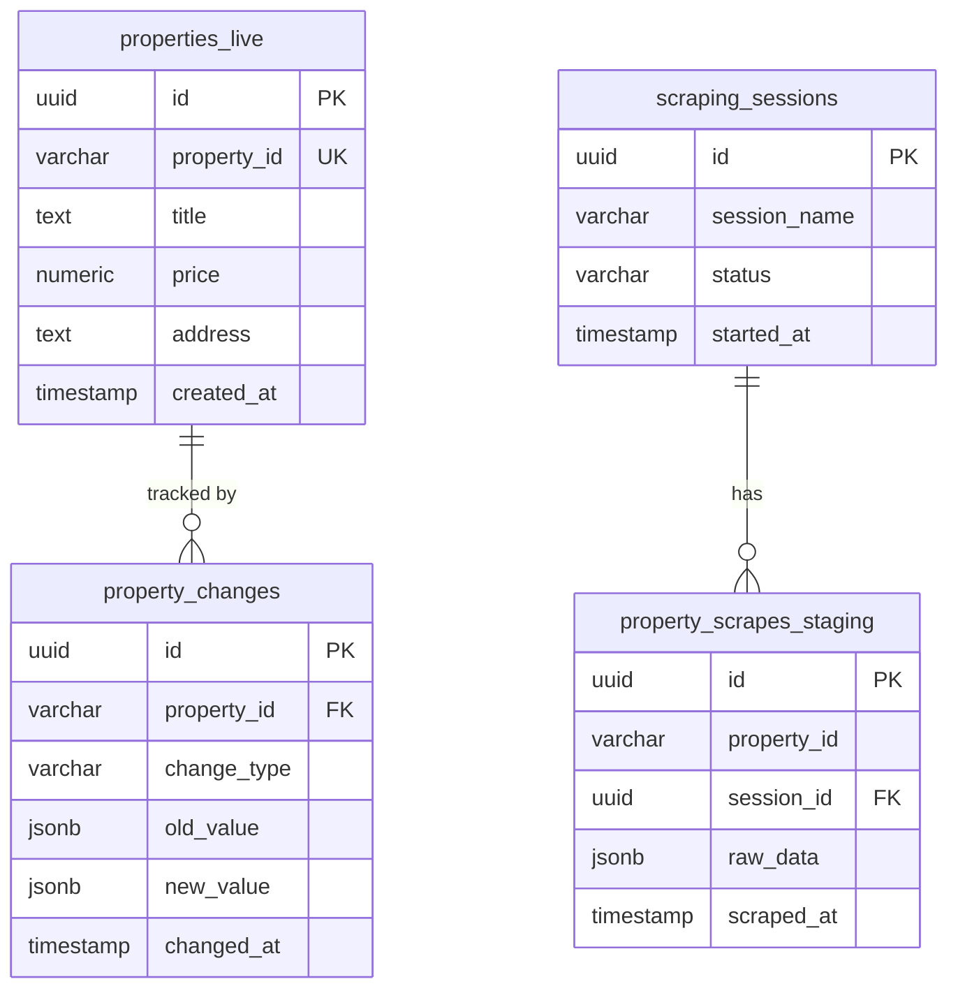

# Database Schema Documentation

**Generated on:** 2025-10-07 14:00:01  
**Database:** Supabase PostgreSQL  
**Project:** PropScraper Property Management System

## Overview

This document contains the complete database schema for the PropScraper system, including all tables, columns, constraints, indexes, and functions.

## Table of Contents

1. [Tables Overview](#tables-overview)
2. [Detailed Table Schemas](#detailed-table-schemas)
3. [Indexes](#indexes)
4. [Functions and Procedures](#functions-and-procedures)
5. [Entity Relationships](#entity-relationships)

## Tables Overview

| Table Name | Type | Columns | Purpose |
|------------|------|---------|---------|

## Detailed Table Schemas

## Functions and Procedures

### create_default_action_plan

**Type:** FUNCTION  
**Returns:** `trigger`

```sql

BEGIN
  INSERT INTO action_plans (user_id, title, description, plan_type)
  VALUES (
    NEW.id,
    'My Home Journey',
    'Track your progress in finding and securing your ideal home',
    'buy'
  );
  RETURN NEW;
END;

```

### create_default_playlist_for_user

**Type:** FUNCTION  
**Returns:** `trigger`

```sql

BEGIN
  INSERT INTO playlists (name, description, user_id, is_default)
  VALUES ('Saved', 'Your saved properties', NEW.id, TRUE);
  RETURN NEW;
END;

```

### debug_rls_context

**Type:** FUNCTION  
**Returns:** `record`

```sql

BEGIN
  RETURN QUERY
  SELECT
    auth.uid()               AS current_auth_uid,
    current_setting('role')  AS current_role_name,
    session_user             AS session_user_name;
END;

```

### gin_extract_query_trgm

**Type:** FUNCTION  
**Returns:** `internal`

### gin_extract_value_trgm

**Type:** FUNCTION  
**Returns:** `internal`

### gin_trgm_consistent

**Type:** FUNCTION  
**Returns:** `boolean`

### gin_trgm_triconsistent

**Type:** FUNCTION  
**Returns:** `"char"`

### gtrgm_compress

**Type:** FUNCTION  
**Returns:** `internal`

### gtrgm_consistent

**Type:** FUNCTION  
**Returns:** `boolean`

### gtrgm_decompress

**Type:** FUNCTION  
**Returns:** `internal`

### gtrgm_distance

**Type:** FUNCTION  
**Returns:** `double precision`

### gtrgm_in

**Type:** FUNCTION  
**Returns:** `USER-DEFINED`

### gtrgm_options

**Type:** FUNCTION  
**Returns:** `void`

### gtrgm_out

**Type:** FUNCTION  
**Returns:** `cstring`

### gtrgm_penalty

**Type:** FUNCTION  
**Returns:** `internal`

### gtrgm_picksplit

**Type:** FUNCTION  
**Returns:** `internal`

### gtrgm_same

**Type:** FUNCTION  
**Returns:** `internal`

### gtrgm_union

**Type:** FUNCTION  
**Returns:** `USER-DEFINED`

### handle_new_user

**Type:** FUNCTION  
**Returns:** `trigger`

```sql

BEGIN
  -- Insert user profile with error handling
  INSERT INTO public.users (id, email, full_name, avatar_url)
  VALUES (
    NEW.id,
    COALESCE(NEW.email, ''),
    COALESCE(NEW.raw_user_meta_data->>'full_name', ''),
    COALESCE(NEW.raw_user_meta_data->>'avatar_url', '')
  )
  ON CONFLICT (id) DO UPDATE SET
    email = EXCLUDED.email,
    full_name = EXCLUDED.full_name,
    avatar_url = EXCLUDED.avatar_url,
    updated_at = NOW();
  
  RETURN NEW;
EXCEPTION
  WHEN OTHERS THEN
    -- Log the error but don't fail the auth user creation
    RAISE WARNING 'Failed to create user profile for %: %', NEW.id, SQLERRM;
    RETURN NEW;
END;

```

### migrate_pulled_properties_to_live

**Type:** FUNCTION  
**Returns:** `integer`

```sql

DECLARE
    migrated_count INTEGER := 0;
BEGIN
    -- Check if pulled_properties table exists
    IF EXISTS (SELECT 1 FROM information_schema.tables WHERE table_name = 'pulled_properties') THEN
        INSERT INTO properties_live (
            property_id, title, description, property_type, operation_type,
            address, neighborhood, city, state, postal_code, latitude, longitude, gps_coordinates,
            price, currency, price_per_m2, bedrooms, bathrooms, half_bathrooms, parking_spaces,
            total_area_m2, covered_area_m2, lot_size_m2, floor_number, total_floors, age_years, construction_year,
            features, amenities, main_image_url, image_urls, virtual_tour_url, video_url,
            agent_name, agent_phone, agent_email, agency_name, message_url,
            is_featured, is_premium, source_url, page_number, listing_date, scraped_at,
            created_at, updated_at, first_seen_at, last_seen_at, last_updated_at
        )
        SELECT 
            property_id, title, description, property_type, operation_type,
            address, neighborhood, city, state, postal_code, latitude, longitude, gps_coordinates,
            price, currency, price_per_m2, bedrooms, bathrooms, half_bathrooms, parking_spaces,
            total_area_m2, covered_area_m2, lot_size_m2, floor_number, total_floors, age_years, construction_year,
            features, amenities, main_image_url, image_urls, virtual_tour_url, video_url,
            agent_name, agent_phone, agent_email, agency_name, message_url,
            is_featured, is_premium, source_url, page_number, listing_date, scraped_at,
            created_at, updated_at, created_at, updated_at, updated_at
        FROM pulled_properties
        WHERE property_id IS NOT NULL
        ON CONFLICT (property_id) DO NOTHING;
        
        GET DIAGNOSTICS migrated_count = ROW_COUNT;
    ELSE
        migrated_count := 0;
    END IF;
    
    RETURN migrated_count;
END;

```

### notify_property_changes

**Type:** FUNCTION  
**Returns:** `trigger`

```sql

BEGIN
    IF TG_OP = 'INSERT' THEN
        PERFORM pg_notify('property_changes', 
            json_build_object('type', 'created', 'id', NEW.id, 'property_id', NEW.property_id)::text);
    ELSIF TG_OP = 'UPDATE' THEN
        PERFORM pg_notify('property_changes', 
            json_build_object('type', 'updated', 'id', NEW.id, 'property_id', NEW.property_id)::text);
    ELSIF TG_OP = 'DELETE' THEN
        PERFORM pg_notify('property_changes', 
            json_build_object('type', 'deleted', 'id', OLD.id, 'property_id', OLD.property_id)::text);
    END IF;
    RETURN COALESCE(NEW, OLD);
END;

```

### refresh_property_stats

**Type:** FUNCTION  
**Returns:** `void`

```sql

BEGIN
    REFRESH MATERIALIZED VIEW CONCURRENTLY property_stats;
END;

```

### set_limit

**Type:** FUNCTION  
**Returns:** `real`

### show_limit

**Type:** FUNCTION  
**Returns:** `real`

### show_trgm

**Type:** FUNCTION  
**Returns:** `ARRAY`

### similarity

**Type:** FUNCTION  
**Returns:** `real`

### similarity_dist

**Type:** FUNCTION  
**Returns:** `real`

### similarity_op

**Type:** FUNCTION  
**Returns:** `boolean`

### strict_word_similarity

**Type:** FUNCTION  
**Returns:** `real`

### strict_word_similarity_commutator_op

**Type:** FUNCTION  
**Returns:** `boolean`

### strict_word_similarity_dist_commutator_op

**Type:** FUNCTION  
**Returns:** `real`

### strict_word_similarity_dist_op

**Type:** FUNCTION  
**Returns:** `real`

### strict_word_similarity_op

**Type:** FUNCTION  
**Returns:** `boolean`

### test_user_favorites_access

**Type:** FUNCTION  
**Returns:** `record`

```sql

DECLARE
    select_result BOOLEAN := FALSE;
    insert_result BOOLEAN := FALSE;
BEGIN
    -- Test SELECT permission
    BEGIN
        PERFORM 1 FROM user_favorites WHERE user_id = test_user_id LIMIT 1;
        select_result := TRUE;
    EXCEPTION WHEN OTHERS THEN
        select_result := FALSE;
    END;

    -- Test INSERT permission (rolled back)
    BEGIN
        INSERT INTO user_favorites (user_id, property_id)
        VALUES (test_user_id, test_property_id);
        insert_result := TRUE;
        -- Raise a custom exception so the transaction can be rolled back but we still know the INSERT succeeded
        RAISE EXCEPTION USING ERRCODE = 'P0001', MESSAGE = 'rollback_test';
    EXCEPTION
        WHEN SQLSTATE 'P0001' THEN
            -- This is the intentional rollback exception
            IF SQLERRM = 'rollback_test' THEN
                insert_result := TRUE;   -- INSERT succeeded before rollback
            ELSE
                insert_result := FALSE;
            END IF;
        WHEN OTHERS THEN
            insert_result := FALSE;
    END;

    RETURN QUERY
    SELECT
        select_result   AS can_select,
        insert_result   AS can_insert,
        auth.uid()      AS auth_uid,
        test_user_id    AS provided_user_id;
END;

```

### update_easybroker_updated_at

**Type:** FUNCTION  
**Returns:** `trigger`

```sql

BEGIN
  NEW.updated_at = NOW();
  RETURN NEW;
END;

```

### update_updated_at_column

**Type:** FUNCTION  
**Returns:** `trigger`

```sql

BEGIN
  NEW.updated_at = NOW();
  RETURN NEW;
END;

```

### word_similarity

**Type:** FUNCTION  
**Returns:** `real`

### word_similarity_commutator_op

**Type:** FUNCTION  
**Returns:** `boolean`

### word_similarity_dist_commutator_op

**Type:** FUNCTION  
**Returns:** `real`

### word_similarity_dist_op

**Type:** FUNCTION  
**Returns:** `real`

### word_similarity_op

**Type:** FUNCTION  
**Returns:** `boolean`

## Entity Relationships


### Primary Relationships



### Key Relationships

1. **Scraping Sessions → Staging Data**
   - One session can have many scraped properties
   - Used to track and batch process scraped data

2. **Staging → Live Properties** 
   - Data flows from staging to live after validation
   - Change detection compares these tables

3. **Properties → Change Log**
   - All property modifications are tracked
   - Provides complete audit trail

4. **Validation Rules → Data Quality**
   - Configurable rules validate staging data
   - Ensures data quality before promotion

## Additional Notes

### Data Types Used
- `uuid` - Universally Unique Identifiers for primary keys
- `text` - Variable-length text strings
- `varchar(n)` - Variable-length strings with maximum length
- `integer` - 32-bit integers
- `numeric` - Arbitrary precision numbers
- `boolean` - True/false values
- `timestamp` - Date and time values
- `jsonb` - Binary JSON data (indexed)
- `real` - Single precision floating-point

### Naming Conventions
- Table names use snake_case
- Primary keys are typically named `id`
- Foreign keys follow the pattern `{table}_id`
- Timestamp columns use `created_at` and `updated_at`
- Boolean columns often use `is_` prefix

### Performance Considerations
- All tables have UUID primary keys for distributed scaling
- Indexes are created on frequently queried columns
- JSONB columns are used for flexible schema requirements
- Full-text search is implemented using PostgreSQL's built-in capabilities

### Security
- Row Level Security (RLS) may be enabled on sensitive tables
- Access is controlled through Supabase policies
- API access is managed through service keys

---

*This documentation was automatically generated from the live database schema.*
