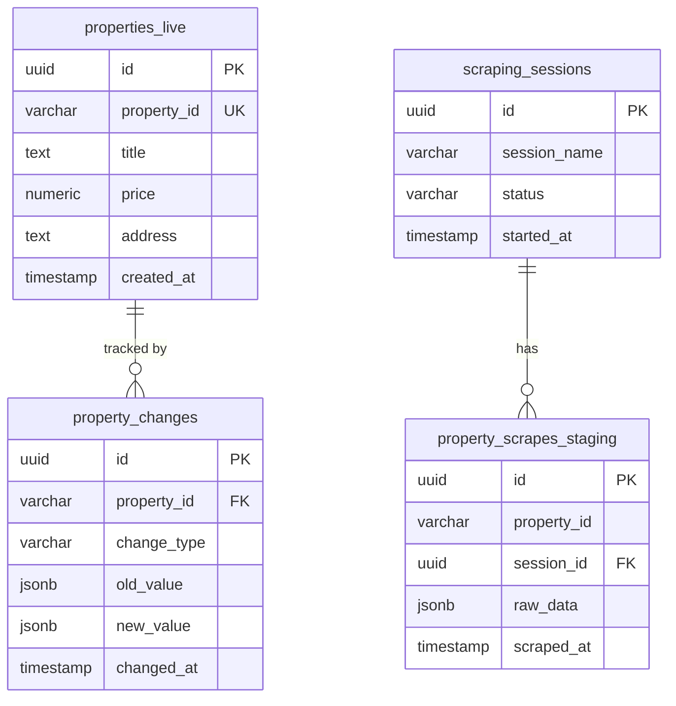

# Database Schema Documentation

**Generated on:** 2025-09-30 13:33:39  
**Database:** Supabase PostgreSQL  
**Project:** PropScraper Property Management System

## Overview

This document contains the complete database schema for the PropScraper system, including all tables, columns, constraints, indexes, and functions.

## Table of Contents

1. [Tables Overview](#tables-overview)
2. [Detailed Table Schemas](#detailed-table-schemas)
3. [Indexes](#indexes)
4. [Functions and Procedures](#functions-and-procedures)
5. [Entity Relationships](#entity-relationships)

## Tables Overview

| Table Name | Type | Columns | Purpose |
|------------|------|---------|---------|
| `chat_conversations` | BASE TABLE | 5 | User chat conversations |
| `chat_messages` | BASE TABLE | 5 | Individual chat messages |
| `playlist_properties` | BASE TABLE | 4 | Application data storage |
| `playlists` | BASE TABLE | 7 | Application data storage |
| `properties` | BASE TABLE | 21 | Main properties table (legacy) |
| `properties_live` | BASE TABLE | 54 | Production property data for frontend |
| `property_changes` | BASE TABLE | 10 | Audit log of property modifications |
| `property_scrapes_staging` | BASE TABLE | 50 | Raw scraped data before validation |
| `pulled_properties` | BASE TABLE | 58 | Legacy scraped properties storage |
| `scraping_errors` | BASE TABLE | 8 | Log errors during scraping operations |
| `scraping_sessions` | BASE TABLE | 14 | Track scraping job sessions and progress |
| `sync_metadata` | BASE TABLE | 15 | Track data synchronization operations |
| `todo_items` | BASE TABLE | 8 | Task management items |
| `todo_lists` | BASE TABLE | 7 | Task management lists |
| `user_favorites` | BASE TABLE | 4 | User saved/favorite properties |
| `users` | BASE TABLE | 8 | User accounts and profiles |
| `validation_rules` | BASE TABLE | 9 | Configurable data validation rules |

## Detailed Table Schemas

### chat_conversations

**Purpose:** User chat conversations

| Column | Type | Nullable | Default | Constraints |
|--------|------|----------|---------|-------------|
| `id` | `uuid` | ❌ | `uuid_generate_v4()` | 🔑 PRIMARY KEY |
| `user_id` | `uuid` | ❌ | `-` | 🔗 FK → users(id) |
| `title` | `text` | ❌ | `-` | - |
| `created_at` | `timestamp with time zone` | ✅ | `now()` | - |
| `updated_at` | `timestamp with time zone` | ✅ | `now()` | - |

### chat_messages

**Purpose:** Individual chat messages

| Column | Type | Nullable | Default | Constraints |
|--------|------|----------|---------|-------------|
| `id` | `uuid` | ❌ | `uuid_generate_v4()` | 🔑 PRIMARY KEY |
| `conversation_id` | `uuid` | ❌ | `-` | 🔗 FK → chat_conversations(id) |
| `role` | `text` | ❌ | `-` | - |
| `content` | `text` | ❌ | `-` | - |
| `created_at` | `timestamp with time zone` | ✅ | `now()` | - |

### playlist_properties

**Purpose:** Application data storage

| Column | Type | Nullable | Default | Constraints |
|--------|------|----------|---------|-------------|
| `id` | `uuid` | ❌ | `gen_random_uuid()` | 🔑 PRIMARY KEY |
| `playlist_id` | `uuid` | ❌ | `-` | 🔗 FK → playlists(id) |
| `property_id` | `character varying` | ❌ | `-` | 🔗 FK → properties_live(property_id) |
| `added_at` | `timestamp with time zone` | ✅ | `now()` | - |

### playlists

**Purpose:** Application data storage

| Column | Type | Nullable | Default | Constraints |
|--------|------|----------|---------|-------------|
| `id` | `uuid` | ❌ | `gen_random_uuid()` | 🔑 PRIMARY KEY |
| `name` | `text` | ❌ | `-` | - |
| `description` | `text` | ✅ | `-` | - |
| `user_id` | `uuid` | ❌ | `-` | - |
| `is_default` | `boolean` | ✅ | `false` | - |
| `created_at` | `timestamp with time zone` | ✅ | `now()` | - |
| `updated_at` | `timestamp with time zone` | ✅ | `now()` | - |

### properties

**Purpose:** Main properties table (legacy)

| Column | Type | Nullable | Default | Constraints |
|--------|------|----------|---------|-------------|
| `id` | `uuid` | ❌ | `uuid_generate_v4()` | 🔑 PRIMARY KEY |
| `address` | `text` | ❌ | `-` | - |
| `city` | `text` | ❌ | `-` | - |
| `state` | `text` | ❌ | `-` | - |
| `zip_code` | `text` | ❌ | `-` | - |
| `price` | `numeric` | ❌ | `-` | - |
| `bedrooms` | `integer` | ❌ | `-` | - |
| `bathrooms` | `numeric` | ❌ | `-` | - |
| `square_feet` | `integer` | ❌ | `-` | - |
| `property_type` | `text` | ❌ | `-` | - |
| `listing_type` | `text` | ❌ | `-` | - |
| `image_url` | `text` | ❌ | `-` | - |
| `description` | `text` | ❌ | `-` | - |
| `features` | `ARRAY` | ✅ | `'{}'::text[]` | - |
| `latitude` | `numeric` | ❌ | `-` | - |
| `longitude` | `numeric` | ❌ | `-` | - |
| `year_built` | `integer` | ❌ | `-` | - |
| `parking` | `integer` | ✅ | `0` | - |
| `is_new` | `boolean` | ✅ | `false` | - |
| `created_at` | `timestamp with time zone` | ✅ | `now()` | - |
| `updated_at` | `timestamp with time zone` | ✅ | `now()` | - |

### properties_live

**Purpose:** Production property data for frontend

| Column | Type | Nullable | Default | Constraints |
|--------|------|----------|---------|-------------|
| `id` | `uuid` | ❌ | `gen_random_uuid()` | 🔑 PRIMARY KEY |
| `created_at` | `timestamp with time zone` | ❌ | `now()` | - |
| `updated_at` | `timestamp with time zone` | ❌ | `now()` | - |
| `property_id` | `character varying` | ❌ | `-` | 📏 MAX(255) |
| `title` | `text` | ❌ | `-` | - |
| `description` | `text` | ✅ | `-` | - |
| `property_type` | `character varying` | ✅ | `-` | 📏 MAX(100) |
| `operation_type` | `character varying` | ✅ | `-` | 📏 MAX(50) |
| `address` | `text` | ✅ | `-` | - |
| `neighborhood` | `character varying` | ✅ | `-` | 📏 MAX(255) |
| `city` | `character varying` | ✅ | `-` | 📏 MAX(255) |
| `state` | `character varying` | ✅ | `-` | 📏 MAX(255) |
| `postal_code` | `character varying` | ✅ | `-` | 📏 MAX(20) |
| `latitude` | `numeric` | ✅ | `-` | - |
| `longitude` | `numeric` | ✅ | `-` | - |
| `gps_coordinates` | `character varying` | ✅ | `-` | 📏 MAX(255) |
| `price` | `numeric` | ✅ | `-` | - |
| `currency` | `character varying` | ✅ | `'MXN'::character varying` | 📏 MAX(10) |
| `price_per_m2` | `numeric` | ✅ | `-` | - |
| `bedrooms` | `integer` | ✅ | `-` | - |
| `bathrooms` | `integer` | ✅ | `-` | - |
| `half_bathrooms` | `integer` | ✅ | `-` | - |
| `parking_spaces` | `integer` | ✅ | `-` | - |
| `total_area_m2` | `numeric` | ✅ | `-` | - |
| `covered_area_m2` | `numeric` | ✅ | `-` | - |
| `lot_size_m2` | `numeric` | ✅ | `-` | - |
| `floor_number` | `integer` | ✅ | `-` | - |
| `total_floors` | `integer` | ✅ | `-` | - |
| `age_years` | `integer` | ✅ | `-` | - |
| `construction_year` | `integer` | ✅ | `-` | - |
| `features` | `jsonb` | ✅ | `-` | - |
| `amenities` | `jsonb` | ✅ | `-` | - |
| `main_image_url` | `text` | ✅ | `-` | - |
| `image_urls` | `jsonb` | ✅ | `-` | - |
| `virtual_tour_url` | `text` | ✅ | `-` | - |
| `video_url` | `text` | ✅ | `-` | - |
| `agent_name` | `character varying` | ✅ | `-` | 📏 MAX(255) |
| `agent_phone` | `character varying` | ✅ | `-` | 📏 MAX(50) |
| `agent_email` | `character varying` | ✅ | `-` | 📏 MAX(255) |
| `agency_name` | `character varying` | ✅ | `-` | 📏 MAX(255) |
| `message_url` | `text` | ✅ | `-` | - |
| `is_featured` | `boolean` | ✅ | `false` | - |
| `is_premium` | `boolean` | ✅ | `false` | - |
| `source_url` | `text` | ❌ | `-` | - |
| `page_number` | `integer` | ✅ | `-` | - |
| `listing_date` | `date` | ✅ | `-` | - |
| `scraped_at` | `timestamp with time zone` | ✅ | `now()` | - |
| `first_seen_at` | `timestamp with time zone` | ✅ | `now()` | - |
| `last_seen_at` | `timestamp with time zone` | ✅ | `now()` | - |
| `last_updated_at` | `timestamp with time zone` | ✅ | `now()` | - |
| `status` | `character varying` | ✅ | `'active'::character varying` | 📏 MAX(50) |
| `data_completeness_score` | `numeric` | ✅ | `0.00` | - |
| `verification_status` | `character varying` | ✅ | `'unverified'::character varying` | 📏 MAX(50) |
| `search_vector` | `tsvector` | ✅ | `-` | - |

### property_changes

**Purpose:** Audit log of property modifications

| Column | Type | Nullable | Default | Constraints |
|--------|------|----------|---------|-------------|
| `id` | `uuid` | ❌ | `gen_random_uuid()` | 🔑 PRIMARY KEY |
| `property_id` | `character varying` | ❌ | `-` | 📏 MAX(255) |
| `session_id` | `uuid` | ✅ | `-` | 🔗 FK → scraping_sessions(id) |
| `change_type` | `character varying` | ❌ | `-` | 📏 MAX(50) |
| `field_name` | `character varying` | ✅ | `-` | 📏 MAX(100) |
| `old_value` | `jsonb` | ✅ | `-` | - |
| `new_value` | `jsonb` | ✅ | `-` | - |
| `confidence_score` | `numeric` | ✅ | `1.00` | - |
| `change_reason` | `text` | ✅ | `-` | - |
| `created_at` | `timestamp with time zone` | ✅ | `now()` | - |

### property_scrapes_staging

**Purpose:** Raw scraped data before validation

| Column | Type | Nullable | Default | Constraints |
|--------|------|----------|---------|-------------|
| `id` | `uuid` | ❌ | `gen_random_uuid()` | 🔑 PRIMARY KEY |
| `session_id` | `uuid` | ❌ | `-` | 🔗 FK → scraping_sessions(id) |
| `property_id` | `character varying` | ❌ | `-` | 📏 MAX(255) |
| `title` | `text` | ❌ | `-` | - |
| `description` | `text` | ✅ | `-` | - |
| `property_type` | `character varying` | ✅ | `-` | 📏 MAX(100) |
| `operation_type` | `character varying` | ✅ | `-` | 📏 MAX(50) |
| `address` | `text` | ✅ | `-` | - |
| `neighborhood` | `character varying` | ✅ | `-` | 📏 MAX(255) |
| `city` | `character varying` | ✅ | `-` | 📏 MAX(255) |
| `state` | `character varying` | ✅ | `-` | 📏 MAX(255) |
| `postal_code` | `character varying` | ✅ | `-` | 📏 MAX(20) |
| `latitude` | `numeric` | ✅ | `-` | - |
| `longitude` | `numeric` | ✅ | `-` | - |
| `gps_coordinates` | `character varying` | ✅ | `-` | 📏 MAX(255) |
| `price` | `numeric` | ✅ | `-` | - |
| `currency` | `character varying` | ✅ | `'MXN'::character varying` | 📏 MAX(10) |
| `price_per_m2` | `numeric` | ✅ | `-` | - |
| `bedrooms` | `integer` | ✅ | `-` | - |
| `bathrooms` | `integer` | ✅ | `-` | - |
| `half_bathrooms` | `integer` | ✅ | `-` | - |
| `parking_spaces` | `integer` | ✅ | `-` | - |
| `total_area_m2` | `numeric` | ✅ | `-` | - |
| `covered_area_m2` | `numeric` | ✅ | `-` | - |
| `lot_size_m2` | `numeric` | ✅ | `-` | - |
| `floor_number` | `integer` | ✅ | `-` | - |
| `total_floors` | `integer` | ✅ | `-` | - |
| `age_years` | `integer` | ✅ | `-` | - |
| `construction_year` | `integer` | ✅ | `-` | - |
| `features` | `jsonb` | ✅ | `-` | - |
| `amenities` | `jsonb` | ✅ | `-` | - |
| `main_image_url` | `text` | ✅ | `-` | - |
| `image_urls` | `jsonb` | ✅ | `-` | - |
| `virtual_tour_url` | `text` | ✅ | `-` | - |
| `video_url` | `text` | ✅ | `-` | - |
| `agent_name` | `character varying` | ✅ | `-` | 📏 MAX(255) |
| `agent_phone` | `character varying` | ✅ | `-` | 📏 MAX(50) |
| `agent_email` | `character varying` | ✅ | `-` | 📏 MAX(255) |
| `agency_name` | `character varying` | ✅ | `-` | 📏 MAX(255) |
| `message_url` | `text` | ✅ | `-` | - |
| `status` | `character varying` | ✅ | `'active'::character varying` | 📏 MAX(50) |
| `is_featured` | `boolean` | ✅ | `false` | - |
| `is_premium` | `boolean` | ✅ | `false` | - |
| `source_url` | `text` | ❌ | `-` | - |
| `page_number` | `integer` | ✅ | `-` | - |
| `listing_date` | `date` | ✅ | `-` | - |
| `scraped_at` | `timestamp with time zone` | ✅ | `now()` | - |
| `processing_status` | `character varying` | ✅ | `'pending'::character varying` | 📏 MAX(50) |
| `change_type` | `character varying` | ✅ | `-` | 📏 MAX(50) |
| `created_at` | `timestamp with time zone` | ✅ | `now()` | - |

### pulled_properties

**Purpose:** Legacy scraped properties storage

| Column | Type | Nullable | Default | Constraints |
|--------|------|----------|---------|-------------|
| `id` | `uuid` | ❌ | `gen_random_uuid()` | 🔑 PRIMARY KEY |
| `created_at` | `timestamp with time zone` | ❌ | `timezone('utc'::text, now())` | - |
| `updated_at` | `timestamp with time zone` | ❌ | `timezone('utc'::text, now())` | - |
| `property_id` | `character varying` | ✅ | `-` | 📏 MAX(255) |
| `title` | `text` | ❌ | `-` | - |
| `description` | `text` | ✅ | `-` | - |
| `property_type` | `character varying` | ✅ | `-` | 📏 MAX(100) |
| `operation_type` | `character varying` | ✅ | `-` | 📏 MAX(50) |
| `address` | `text` | ✅ | `-` | - |
| `neighborhood` | `character varying` | ✅ | `-` | 📏 MAX(255) |
| `city` | `character varying` | ✅ | `-` | 📏 MAX(255) |
| `state` | `character varying` | ✅ | `-` | 📏 MAX(255) |
| `postal_code` | `character varying` | ✅ | `-` | 📏 MAX(20) |
| `latitude` | `numeric` | ✅ | `-` | - |
| `longitude` | `numeric` | ✅ | `-` | - |
| `price` | `numeric` | ✅ | `-` | - |
| `currency` | `character varying` | ✅ | `'MXN'::character varying` | 📏 MAX(10) |
| `price_per_m2` | `numeric` | ✅ | `-` | - |
| `bedrooms` | `integer` | ✅ | `-` | - |
| `bathrooms` | `integer` | ✅ | `-` | - |
| `half_bathrooms` | `integer` | ✅ | `-` | - |
| `parking_spaces` | `integer` | ✅ | `-` | - |
| `total_area_m2` | `numeric` | ✅ | `-` | - |
| `covered_area_m2` | `numeric` | ✅ | `-` | - |
| `lot_size_m2` | `numeric` | ✅ | `-` | - |
| `floor_number` | `integer` | ✅ | `-` | - |
| `total_floors` | `integer` | ✅ | `-` | - |
| `age_years` | `integer` | ✅ | `-` | - |
| `construction_year` | `integer` | ✅ | `-` | - |
| `features` | `jsonb` | ✅ | `-` | - |
| `amenities` | `jsonb` | ✅ | `-` | - |
| `main_image_url` | `text` | ✅ | `-` | - |
| `image_urls` | `jsonb` | ✅ | `-` | - |
| `virtual_tour_url` | `text` | ✅ | `-` | - |
| `video_url` | `text` | ✅ | `-` | - |
| `agent_name` | `character varying` | ✅ | `-` | 📏 MAX(255) |
| `agent_phone` | `character varying` | ✅ | `-` | 📏 MAX(50) |
| `agent_email` | `character varying` | ✅ | `-` | 📏 MAX(255) |
| `agency_name` | `character varying` | ✅ | `-` | 📏 MAX(255) |
| `status` | `character varying` | ✅ | `'active'::character varying` | 📏 MAX(50) |
| `is_featured` | `boolean` | ✅ | `false` | - |
| `is_premium` | `boolean` | ✅ | `false` | - |
| `source_url` | `text` | ❌ | `-` | - |
| `scraped_at` | `timestamp with time zone` | ✅ | `timezone('utc'::text, now())` | - |
| `page_number` | `integer` | ✅ | `-` | - |
| `listing_date` | `date` | ✅ | `-` | - |
| `has_pool` | `boolean` | ✅ | `false` | - |
| `has_garden` | `boolean` | ✅ | `false` | - |
| `has_elevator` | `boolean` | ✅ | `false` | - |
| `has_balcony` | `boolean` | ✅ | `false` | - |
| `has_terrace` | `boolean` | ✅ | `false` | - |
| `has_gym` | `boolean` | ✅ | `false` | - |
| `has_security` | `boolean` | ✅ | `false` | - |
| `pet_friendly` | `boolean` | ✅ | `false` | - |
| `furnished` | `boolean` | ✅ | `false` | - |
| `search_vector` | `tsvector` | ✅ | `-` | - |
| `gps_coordinates` | `character varying` | ✅ | `-` | 📏 MAX(255) |
| `message_url` | `text` | ✅ | `-` | - |

### scraping_errors

**Purpose:** Log errors during scraping operations

| Column | Type | Nullable | Default | Constraints |
|--------|------|----------|---------|-------------|
| `id` | `uuid` | ❌ | `gen_random_uuid()` | 🔑 PRIMARY KEY |
| `created_at` | `timestamp with time zone` | ❌ | `timezone('utc'::text, now())` | - |
| `session_id` | `uuid` | ✅ | `-` | 🔗 FK → scraping_sessions(id) |
| `url` | `text` | ❌ | `-` | - |
| `error_type` | `character varying` | ✅ | `-` | 📏 MAX(100) |
| `error_message` | `text` | ✅ | `-` | - |
| `retry_count` | `integer` | ✅ | `0` | - |
| `resolved` | `boolean` | ✅ | `false` | - |

### scraping_sessions

**Purpose:** Track scraping job sessions and progress

| Column | Type | Nullable | Default | Constraints |
|--------|------|----------|---------|-------------|
| `id` | `uuid` | ❌ | `gen_random_uuid()` | 🔑 PRIMARY KEY |
| `created_at` | `timestamp with time zone` | ❌ | `timezone('utc'::text, now())` | - |
| `session_name` | `character varying` | ✅ | `-` | 📏 MAX(255) |
| `base_url` | `text` | ❌ | `-` | - |
| `total_pages` | `integer` | ✅ | `-` | - |
| `pages_scraped` | `integer` | ✅ | `0` | - |
| `properties_found` | `integer` | ✅ | `0` | - |
| `properties_inserted` | `integer` | ✅ | `0` | - |
| `properties_updated` | `integer` | ✅ | `0` | - |
| `status` | `character varying` | ✅ | `'running'::character varying` | 📏 MAX(50) |
| `error_message` | `text` | ✅ | `-` | - |
| `started_at` | `timestamp with time zone` | ✅ | `timezone('utc'::text, now())` | - |
| `completed_at` | `timestamp with time zone` | ✅ | `-` | - |
| `filters_applied` | `jsonb` | ✅ | `-` | - |

### sync_metadata

**Purpose:** Track data synchronization operations

| Column | Type | Nullable | Default | Constraints |
|--------|------|----------|---------|-------------|
| `id` | `uuid` | ❌ | `gen_random_uuid()` | 🔑 PRIMARY KEY |
| `session_id` | `uuid` | ❌ | `-` | 🔗 FK → scraping_sessions(id) |
| `total_scraped` | `integer` | ✅ | `0` | - |
| `new_properties` | `integer` | ✅ | `0` | - |
| `updated_properties` | `integer` | ✅ | `0` | - |
| `removed_properties` | `integer` | ✅ | `0` | - |
| `unchanged_properties` | `integer` | ✅ | `0` | - |
| `data_quality_score` | `numeric` | ✅ | `-` | - |
| `completeness_rate` | `numeric` | ✅ | `-` | - |
| `sync_duration_ms` | `integer` | ✅ | `-` | - |
| `staging_to_live_duration_ms` | `integer` | ✅ | `-` | - |
| `sync_status` | `character varying` | ✅ | `'pending'::character varying` | 📏 MAX(50) |
| `error_summary` | `text` | ✅ | `-` | - |
| `created_at` | `timestamp with time zone` | ✅ | `now()` | - |
| `completed_at` | `timestamp with time zone` | ✅ | `-` | - |

### todo_items

**Purpose:** Task management items

| Column | Type | Nullable | Default | Constraints |
|--------|------|----------|---------|-------------|
| `id` | `uuid` | ❌ | `uuid_generate_v4()` | 🔑 PRIMARY KEY |
| `list_id` | `uuid` | ❌ | `-` | 🔗 FK → todo_lists(id) |
| `title` | `text` | ❌ | `-` | - |
| `description` | `text` | ✅ | `-` | - |
| `completed` | `boolean` | ✅ | `false` | - |
| `order_index` | `integer` | ❌ | `0` | - |
| `created_at` | `timestamp with time zone` | ✅ | `now()` | - |
| `updated_at` | `timestamp with time zone` | ✅ | `now()` | - |

### todo_lists

**Purpose:** Task management lists

| Column | Type | Nullable | Default | Constraints |
|--------|------|----------|---------|-------------|
| `id` | `uuid` | ❌ | `uuid_generate_v4()` | 🔑 PRIMARY KEY |
| `user_id` | `uuid` | ❌ | `-` | 🔗 FK → users(id) |
| `title` | `text` | ❌ | `-` | - |
| `description` | `text` | ✅ | `-` | - |
| `created_by_ai` | `boolean` | ✅ | `false` | - |
| `created_at` | `timestamp with time zone` | ✅ | `now()` | - |
| `updated_at` | `timestamp with time zone` | ✅ | `now()` | - |

### user_favorites

**Purpose:** User saved/favorite properties

| Column | Type | Nullable | Default | Constraints |
|--------|------|----------|---------|-------------|
| `id` | `uuid` | ❌ | `uuid_generate_v4()` | 🔑 PRIMARY KEY |
| `user_id` | `uuid` | ❌ | `-` | 🔗 FK → users(id) |
| `property_id` | `uuid` | ❌ | `-` | 🔗 FK → properties_live(id) |
| `created_at` | `timestamp with time zone` | ✅ | `now()` | - |

### users

**Purpose:** User accounts and profiles

| Column | Type | Nullable | Default | Constraints |
|--------|------|----------|---------|-------------|
| `id` | `uuid` | ❌ | `-` | 🔑 PRIMARY KEY |
| `email` | `text` | ❌ | `-` | - |
| `full_name` | `text` | ✅ | `-` | - |
| `avatar_url` | `text` | ✅ | `-` | - |
| `phone` | `text` | ✅ | `-` | - |
| `preferences` | `jsonb` | ✅ | `'{}'::jsonb` | - |
| `created_at` | `timestamp with time zone` | ✅ | `now()` | - |
| `updated_at` | `timestamp with time zone` | ✅ | `now()` | - |

### validation_rules

**Purpose:** Configurable data validation rules

| Column | Type | Nullable | Default | Constraints |
|--------|------|----------|---------|-------------|
| `id` | `uuid` | ❌ | `gen_random_uuid()` | 🔑 PRIMARY KEY |
| `rule_name` | `character varying` | ❌ | `-` | 📏 MAX(100) |
| `field_name` | `character varying` | ❌ | `-` | 📏 MAX(100) |
| `rule_type` | `character varying` | ❌ | `-` | 📏 MAX(50) |
| `rule_config` | `jsonb` | ❌ | `-` | - |
| `severity` | `character varying` | ✅ | `'warning'::character varying` | 📏 MAX(20) |
| `is_active` | `boolean` | ✅ | `true` | - |
| `created_at` | `timestamp with time zone` | ✅ | `now()` | - |
| `updated_at` | `timestamp with time zone` | ✅ | `now()` | - |

## Indexes

| Table | Index Name | Definition |
|-------|------------|------------|
| `chat_conversations` | `chat_conversations_pkey` | `CREATE UNIQUE INDEX chat_conversations_pkey ON public.chat_conversations USING btree (id)` |
| `chat_messages` | `chat_messages_pkey` | `CREATE UNIQUE INDEX chat_messages_pkey ON public.chat_messages USING btree (id)` |
| `chat_messages` | `idx_chat_messages_conversation_id` | `CREATE INDEX idx_chat_messages_conversation_id ON public.chat_messages USING btree (conversation_id)` |
| `playlist_properties` | `idx_playlist_properties_playlist_id` | `CREATE INDEX idx_playlist_properties_playlist_id ON public.playlist_properties USING btree (playlist_id)` |
| `playlist_properties` | `idx_playlist_properties_property_id` | `CREATE INDEX idx_playlist_properties_property_id ON public.playlist_properties USING btree (property_id)` |
| `playlist_properties` | `playlist_properties_pkey` | `CREATE UNIQUE INDEX playlist_properties_pkey ON public.playlist_properties USING btree (id)` |
| `playlist_properties` | `playlist_properties_playlist_id_property_id_key` | `CREATE UNIQUE INDEX playlist_properties_playlist_id_property_id_key ON public.playlist_properties USING btree (playlist_id, property_id)` |
| `playlists` | `idx_playlists_is_default` | `CREATE INDEX idx_playlists_is_default ON public.playlists USING btree (is_default)` |
| `playlists` | `idx_playlists_user_id` | `CREATE INDEX idx_playlists_user_id ON public.playlists USING btree (user_id)` |
| `playlists` | `playlists_pkey` | `CREATE UNIQUE INDEX playlists_pkey ON public.playlists USING btree (id)` |
| `properties` | `idx_properties_bathrooms` | `CREATE INDEX idx_properties_bathrooms ON public.properties USING btree (bathrooms)` |
| `properties` | `idx_properties_bedrooms` | `CREATE INDEX idx_properties_bedrooms ON public.properties USING btree (bedrooms)` |
| `properties` | `idx_properties_city` | `CREATE INDEX idx_properties_city ON public.properties USING btree (city)` |
| `properties` | `idx_properties_listing_type` | `CREATE INDEX idx_properties_listing_type ON public.properties USING btree (listing_type)` |
| `properties` | `idx_properties_location` | `CREATE INDEX idx_properties_location ON public.properties USING btree (latitude, longitude)` |
| `properties` | `idx_properties_price` | `CREATE INDEX idx_properties_price ON public.properties USING btree (price)` |
| `properties` | `idx_properties_property_type` | `CREATE INDEX idx_properties_property_type ON public.properties USING btree (property_type)` |
| `properties` | `idx_properties_state` | `CREATE INDEX idx_properties_state ON public.properties USING btree (state)` |
| `properties` | `properties_pkey` | `CREATE UNIQUE INDEX properties_pkey ON public.properties USING btree (id)` |
| `properties_live` | `idx_properties_active` | `CREATE INDEX idx_properties_active ON public.properties_live USING btree (last_updated_at) WHERE ((status)::text = 'active'::text)` |
| `properties_live` | `idx_properties_live_amenities` | `CREATE INDEX idx_properties_live_amenities ON public.properties_live USING gin (amenities)` |
| `properties_live` | `idx_properties_live_bedrooms` | `CREATE INDEX idx_properties_live_bedrooms ON public.properties_live USING btree (bedrooms)` |
| `properties_live` | `idx_properties_live_city` | `CREATE INDEX idx_properties_live_city ON public.properties_live USING btree (city)` |
| `properties_live` | `idx_properties_live_last_updated` | `CREATE INDEX idx_properties_live_last_updated ON public.properties_live USING btree (last_updated_at)` |
| `properties_live` | `idx_properties_live_location` | `CREATE INDEX idx_properties_live_location ON public.properties_live USING btree (latitude, longitude) WHERE ((latitude IS NOT NULL) AND (longitude IS NOT NULL))` |
| `properties_live` | `idx_properties_live_neighborhood` | `CREATE INDEX idx_properties_live_neighborhood ON public.properties_live USING btree (neighborhood)` |
| `properties_live` | `idx_properties_live_operation_type` | `CREATE INDEX idx_properties_live_operation_type ON public.properties_live USING btree (operation_type)` |
| `properties_live` | `idx_properties_live_price` | `CREATE INDEX idx_properties_live_price ON public.properties_live USING btree (price)` |
| `properties_live` | `idx_properties_live_property_type` | `CREATE INDEX idx_properties_live_property_type ON public.properties_live USING btree (property_type)` |
| `properties_live` | `idx_properties_live_search` | `CREATE INDEX idx_properties_live_search ON public.properties_live USING gin (search_vector)` |
| `properties_live` | `idx_properties_live_status` | `CREATE INDEX idx_properties_live_status ON public.properties_live USING btree (status)` |
| `properties_live` | `properties_live_pkey` | `CREATE UNIQUE INDEX properties_live_pkey ON public.properties_live USING btree (id)` |
| `properties_live` | `properties_live_property_id_key` | `CREATE UNIQUE INDEX properties_live_property_id_key ON public.properties_live USING btree (property_id)` |
| `property_changes` | `idx_property_changes_created_at` | `CREATE INDEX idx_property_changes_created_at ON public.property_changes USING btree (created_at)` |
| `property_changes` | `idx_property_changes_property_id` | `CREATE INDEX idx_property_changes_property_id ON public.property_changes USING btree (property_id)` |
| `property_changes` | `idx_property_changes_session_id` | `CREATE INDEX idx_property_changes_session_id ON public.property_changes USING btree (session_id)` |
| `property_changes` | `idx_property_changes_type` | `CREATE INDEX idx_property_changes_type ON public.property_changes USING btree (change_type)` |
| `property_changes` | `property_changes_pkey` | `CREATE UNIQUE INDEX property_changes_pkey ON public.property_changes USING btree (id)` |
| `property_scrapes_staging` | `idx_staging_change_type` | `CREATE INDEX idx_staging_change_type ON public.property_scrapes_staging USING btree (change_type)` |
| `property_scrapes_staging` | `idx_staging_property_id` | `CREATE INDEX idx_staging_property_id ON public.property_scrapes_staging USING btree (property_id)` |
| `property_scrapes_staging` | `idx_staging_scraped_at` | `CREATE INDEX idx_staging_scraped_at ON public.property_scrapes_staging USING btree (scraped_at)` |
| `property_scrapes_staging` | `idx_staging_session_status` | `CREATE INDEX idx_staging_session_status ON public.property_scrapes_staging USING btree (session_id, processing_status)` |
| `property_scrapes_staging` | `property_scrapes_staging_pkey` | `CREATE UNIQUE INDEX property_scrapes_staging_pkey ON public.property_scrapes_staging USING btree (id)` |
| `property_scrapes_staging` | `unique_property_per_session` | `CREATE UNIQUE INDEX unique_property_per_session ON public.property_scrapes_staging USING btree (session_id, property_id)` |
| `property_stats` | `property_stats_unique_idx` | `CREATE UNIQUE INDEX property_stats_unique_idx ON public.property_stats USING btree (property_type, operation_type, city)` |
| `pulled_properties` | `idx_pulled_properties_amenities` | `CREATE INDEX idx_pulled_properties_amenities ON public.pulled_properties USING gin (amenities)` |
| `pulled_properties` | `idx_pulled_properties_bedrooms` | `CREATE INDEX idx_pulled_properties_bedrooms ON public.pulled_properties USING btree (bedrooms)` |
| `pulled_properties` | `idx_pulled_properties_city` | `CREATE INDEX idx_pulled_properties_city ON public.pulled_properties USING btree (city)` |
| `pulled_properties` | `idx_pulled_properties_latitude` | `CREATE INDEX idx_pulled_properties_latitude ON public.pulled_properties USING btree (latitude) WHERE (latitude IS NOT NULL)` |
| `pulled_properties` | `idx_pulled_properties_longitude` | `CREATE INDEX idx_pulled_properties_longitude ON public.pulled_properties USING btree (longitude) WHERE (longitude IS NOT NULL)` |
| `pulled_properties` | `idx_pulled_properties_neighborhood` | `CREATE INDEX idx_pulled_properties_neighborhood ON public.pulled_properties USING btree (neighborhood)` |
| `pulled_properties` | `idx_pulled_properties_operation_type` | `CREATE INDEX idx_pulled_properties_operation_type ON public.pulled_properties USING btree (operation_type)` |
| `pulled_properties` | `idx_pulled_properties_price` | `CREATE INDEX idx_pulled_properties_price ON public.pulled_properties USING btree (price)` |
| `pulled_properties` | `idx_pulled_properties_property_type` | `CREATE INDEX idx_pulled_properties_property_type ON public.pulled_properties USING btree (property_type)` |
| `pulled_properties` | `idx_pulled_properties_scraped_at` | `CREATE INDEX idx_pulled_properties_scraped_at ON public.pulled_properties USING btree (scraped_at)` |
| `pulled_properties` | `idx_pulled_properties_search` | `CREATE INDEX idx_pulled_properties_search ON public.pulled_properties USING gin (search_vector)` |
| `pulled_properties` | `idx_pulled_properties_status` | `CREATE INDEX idx_pulled_properties_status ON public.pulled_properties USING btree (status)` |
| `pulled_properties` | `pulled_properties_pkey` | `CREATE UNIQUE INDEX pulled_properties_pkey ON public.pulled_properties USING btree (id)` |
| `pulled_properties` | `pulled_properties_property_id_key` | `CREATE UNIQUE INDEX pulled_properties_property_id_key ON public.pulled_properties USING btree (property_id)` |
| `scraping_errors` | `scraping_errors_pkey` | `CREATE UNIQUE INDEX scraping_errors_pkey ON public.scraping_errors USING btree (id)` |
| `scraping_sessions` | `scraping_sessions_pkey` | `CREATE UNIQUE INDEX scraping_sessions_pkey ON public.scraping_sessions USING btree (id)` |
| `sync_metadata` | `idx_sync_metadata_created_at` | `CREATE INDEX idx_sync_metadata_created_at ON public.sync_metadata USING btree (created_at)` |
| `sync_metadata` | `idx_sync_metadata_session_id` | `CREATE INDEX idx_sync_metadata_session_id ON public.sync_metadata USING btree (session_id)` |
| `sync_metadata` | `idx_sync_metadata_status` | `CREATE INDEX idx_sync_metadata_status ON public.sync_metadata USING btree (sync_status)` |
| `sync_metadata` | `sync_metadata_pkey` | `CREATE UNIQUE INDEX sync_metadata_pkey ON public.sync_metadata USING btree (id)` |
| `todo_items` | `idx_todo_items_list_id` | `CREATE INDEX idx_todo_items_list_id ON public.todo_items USING btree (list_id)` |
| `todo_items` | `idx_todo_items_order` | `CREATE INDEX idx_todo_items_order ON public.todo_items USING btree (list_id, order_index)` |
| `todo_items` | `todo_items_pkey` | `CREATE UNIQUE INDEX todo_items_pkey ON public.todo_items USING btree (id)` |
| `todo_lists` | `idx_todo_lists_user_id` | `CREATE INDEX idx_todo_lists_user_id ON public.todo_lists USING btree (user_id)` |
| `todo_lists` | `todo_lists_pkey` | `CREATE UNIQUE INDEX todo_lists_pkey ON public.todo_lists USING btree (id)` |
| `user_favorites` | `idx_user_favorites_user_id` | `CREATE INDEX idx_user_favorites_user_id ON public.user_favorites USING btree (user_id)` |
| `user_favorites` | `user_favorites_pkey` | `CREATE UNIQUE INDEX user_favorites_pkey ON public.user_favorites USING btree (id)` |
| `user_favorites` | `user_favorites_user_id_property_id_key` | `CREATE UNIQUE INDEX user_favorites_user_id_property_id_key ON public.user_favorites USING btree (user_id, property_id)` |
| `users` | `idx_users_email` | `CREATE INDEX idx_users_email ON public.users USING btree (email)` |
| `users` | `users_pkey` | `CREATE UNIQUE INDEX users_pkey ON public.users USING btree (id)` |
| `validation_rules` | `idx_validation_rules_field_name` | `CREATE INDEX idx_validation_rules_field_name ON public.validation_rules USING btree (field_name)` |
| `validation_rules` | `idx_validation_rules_rule_name` | `CREATE INDEX idx_validation_rules_rule_name ON public.validation_rules USING btree (rule_name)` |
| `validation_rules` | `validation_rules_pkey` | `CREATE UNIQUE INDEX validation_rules_pkey ON public.validation_rules USING btree (id)` |
| `validation_rules` | `validation_rules_rule_name_key` | `CREATE UNIQUE INDEX validation_rules_rule_name_key ON public.validation_rules USING btree (rule_name)` |

## Functions and Procedures

### create_default_playlist_for_user

**Type:** FUNCTION  
**Returns:** `trigger`

```sql

BEGIN

  INSERT INTO playlists (name, description, user_id, is_default)

  VALUES ('Saved', 'Your saved properties', NEW.id, TRUE);

  RETURN NEW;

END;


```

### debug_rls_context

**Type:** FUNCTION  
**Returns:** `record`

```sql

BEGIN

  RETURN QUERY

  SELECT
    auth.uid()               AS current_auth_uid,

    current_setting('role')  AS current_role_name,

    session_user             AS session_user_name;

END;


```

### gin_extract_query_trgm

**Type:** FUNCTION  
**Returns:** `internal`

### gin_extract_value_trgm

**Type:** FUNCTION  
**Returns:** `internal`

### gin_trgm_consistent

**Type:** FUNCTION  
**Returns:** `boolean`

### gin_trgm_triconsistent

**Type:** FUNCTION  
**Returns:** `"char"`

### gtrgm_compress

**Type:** FUNCTION  
**Returns:** `internal`

### gtrgm_consistent

**Type:** FUNCTION  
**Returns:** `boolean`

### gtrgm_decompress

**Type:** FUNCTION  
**Returns:** `internal`

### gtrgm_distance

**Type:** FUNCTION  
**Returns:** `double precision`

### gtrgm_in

**Type:** FUNCTION  
**Returns:** `USER-DEFINED`

### gtrgm_options

**Type:** FUNCTION  
**Returns:** `void`

### gtrgm_out

**Type:** FUNCTION  
**Returns:** `cstring`

### gtrgm_penalty

**Type:** FUNCTION  
**Returns:** `internal`

### gtrgm_picksplit

**Type:** FUNCTION  
**Returns:** `internal`

### gtrgm_same

**Type:** FUNCTION  
**Returns:** `internal`

### gtrgm_union

**Type:** FUNCTION  
**Returns:** `USER-DEFINED`

### handle_new_user

**Type:** FUNCTION  
**Returns:** `trigger`

```sql

BEGIN

  -- Insert user profile with error handling

  INSERT INTO public.users (id, email, full_name, avatar_url)

  VALUES (

    NEW.id,

    COALESCE(NEW.email, ''),

    COALESCE(NEW.raw_user_meta_data->>'full_name', ''),

    COALESCE(NEW.raw_user_meta_data->>'avatar_url', '')

  )

  ON CONFLICT (id) DO UPDATE SET

    email = EXCLUDED.email,

    full_name = EXCLUDED.full_name,

    avatar_url = EXCLUDED.avatar_url,

    updated_at = NOW();

  
  RETURN NEW;

EXCEPTION

  WHEN OTHERS THEN

    -- Log the error but don't fail the auth user creation

    RAISE WARNING 'Failed to create user profile for %: %', NEW.id, SQLERRM;

    RETURN NEW;

END;


```

### migrate_pulled_properties_to_live

**Type:** FUNCTION  
**Returns:** `integer`

```sql

DECLARE

    migrated_count INTEGER := 0;

BEGIN

    -- Check if pulled_properties table exists

    IF EXISTS (SELECT 1 FROM information_schema.tables WHERE table_name = 'pulled_properties') THEN

        INSERT INTO properties_live (

            property_id, title, description, property_type, operation_type,

            address, neighborhood, city, state, postal_code, latitude, longitude, gps_coordinates,

            price, currency, price_per_m2, bedrooms, bathrooms, half_bathrooms, parking_spaces,

            total_area_m2, covered_area_m2, lot_size_m2, floor_number, total_floors, age_years, construction_year,

            features, amenities, main_image_url, image_urls, virtual_tour_url, video_url,

            agent_name, agent_phone, agent_email, agency_name, message_url,

            is_featured, is_premium, source_url, page_number, listing_date, scraped_at,

            created_at, updated_at, first_seen_at, last_seen_at, last_updated_at

        )

        SELECT 
            property_id, title, description, property_type, operation_type,

            address, neighborhood, city, state, postal_code, latitude, longitude, gps_coordinates,

            price, currency, price_per_m2, bedrooms, bathrooms, half_bathrooms, parking_spaces,

            total_area_m2, covered_area_m2, lot_size_m2, floor_number, total_floors, age_years, construction_year,

            features, amenities, main_image_url, image_urls, virtual_tour_url, video_url,

            agent_name, agent_phone, agent_email, agency_name, message_url,

            is_featured, is_premium, source_url, page_number, listing_date, scraped_at,

            created_at, updated_at, created_at, updated_at, updated_at

        FROM pulled_properties

        WHERE property_id IS NOT NULL

        ON CONFLICT (property_id) DO NOTHING;

        
        GET DIAGNOSTICS migrated_count = ROW_COUNT;

    ELSE

        migrated_count := 0;

    END IF;

    
    RETURN migrated_count;

END;


```

### notify_property_changes

**Type:** FUNCTION  
**Returns:** `trigger`

```sql

BEGIN

    IF TG_OP = 'INSERT' THEN

        PERFORM pg_notify('property_changes', 
 
            json_build_object('type', 'created', 'id', NEW.id, 'property_id', NEW.property_id)::text);

    ELSIF TG_OP = 'UPDATE' THEN

        PERFORM pg_notify('property_changes', 
 
            json_build_object('type', 'updated', 'id', NEW.id, 'property_id', NEW.property_id)::text);

    ELSIF TG_OP = 'DELETE' THEN

        PERFORM pg_notify('property_changes', 
 
            json_build_object('type', 'deleted', 'id', OLD.id, 'property_id', OLD.property_id)::text);

    END IF;

    RETURN COALESCE(NEW, OLD);

END;


```

### refresh_property_stats

**Type:** FUNCTION  
**Returns:** `void`

```sql

BEGIN

    REFRESH MATERIALIZED VIEW CONCURRENTLY property_stats;

END;


```

### set_limit

**Type:** FUNCTION  
**Returns:** `real`

### show_limit

**Type:** FUNCTION  
**Returns:** `real`

### show_trgm

**Type:** FUNCTION  
**Returns:** `ARRAY`

### similarity

**Type:** FUNCTION  
**Returns:** `real`

### similarity_dist

**Type:** FUNCTION  
**Returns:** `real`

### similarity_op

**Type:** FUNCTION  
**Returns:** `boolean`

### strict_word_similarity

**Type:** FUNCTION  
**Returns:** `real`

### strict_word_similarity_commutator_op

**Type:** FUNCTION  
**Returns:** `boolean`

### strict_word_similarity_dist_commutator_op

**Type:** FUNCTION  
**Returns:** `real`

### strict_word_similarity_dist_op

**Type:** FUNCTION  
**Returns:** `real`

### strict_word_similarity_op

**Type:** FUNCTION  
**Returns:** `boolean`

### test_user_favorites_access

**Type:** FUNCTION  
**Returns:** `record`

```sql

DECLARE

    select_result BOOLEAN := FALSE;

    insert_result BOOLEAN := FALSE;

BEGIN

    -- Test SELECT permission

    BEGIN

        PERFORM 1 FROM user_favorites WHERE user_id = test_user_id LIMIT 1;

        select_result := TRUE;

    EXCEPTION WHEN OTHERS THEN

        select_result := FALSE;

    END;


    -- Test INSERT permission (rolled back)

    BEGIN

        INSERT INTO user_favorites (user_id, property_id)

        VALUES (test_user_id, test_property_id);

        insert_result := TRUE;

        -- Raise a custom exception so the transaction can be rolled back but we still know the INSERT succeeded

        RAISE EXCEPTION USING ERRCODE = 'P0001', MESSAGE = 'rollback_test';

    EXCEPTION

        WHEN SQLSTATE 'P0001' THEN

            -- This is the intentional rollback exception

            IF SQLERRM = 'rollback_test' THEN

                insert_result := TRUE;   -- INSERT succeeded before rollback

            ELSE

                insert_result := FALSE;

            END IF;

        WHEN OTHERS THEN

            insert_result := FALSE;

    END;


    RETURN QUERY

    SELECT
        select_result   AS can_select,

        insert_result   AS can_insert,

        auth.uid()      AS auth_uid,

        test_user_id    AS provided_user_id;

END;


```

### update_updated_at_column

**Type:** FUNCTION  
**Returns:** `trigger`

```sql

BEGIN

  NEW.updated_at = NOW();

  RETURN NEW;

END;


```

### word_similarity

**Type:** FUNCTION  
**Returns:** `real`

### word_similarity_commutator_op

**Type:** FUNCTION  
**Returns:** `boolean`

### word_similarity_dist_commutator_op

**Type:** FUNCTION  
**Returns:** `real`

### word_similarity_dist_op

**Type:** FUNCTION  
**Returns:** `real`

### word_similarity_op

**Type:** FUNCTION  
**Returns:** `boolean`

## Entity Relationships


### Primary Relationships



### Key Relationships

1. **Scraping Sessions → Staging Data**
   - One session can have many scraped properties
   - Used to track and batch process scraped data

2. **Staging → Live Properties** 
   - Data flows from staging to live after validation
   - Change detection compares these tables

3. **Properties → Change Log**
   - All property modifications are tracked
   - Provides complete audit trail

4. **Validation Rules → Data Quality**
   - Configurable rules validate staging data
   - Ensures data quality before promotion

## Additional Notes

### Data Types Used
- `uuid` - Universally Unique Identifiers for primary keys
- `text` - Variable-length text strings
- `varchar(n)` - Variable-length strings with maximum length
- `integer` - 32-bit integers
- `numeric` - Arbitrary precision numbers
- `boolean` - True/false values
- `timestamp` - Date and time values
- `jsonb` - Binary JSON data (indexed)
- `real` - Single precision floating-point

### Naming Conventions
- Table names use snake_case
- Primary keys are typically named `id`
- Foreign keys follow the pattern `{table}_id`
- Timestamp columns use `created_at` and `updated_at`
- Boolean columns often use `is_` prefix

### Performance Considerations
- All tables have UUID primary keys for distributed scaling
- Indexes are created on frequently queried columns
- JSONB columns are used for flexible schema requirements
- Full-text search is implemented using PostgreSQL's built-in capabilities

### Security
- Row Level Security (RLS) may be enabled on sensitive tables
- Access is controlled through Supabase policies
- API access is managed through service keys

---

*This documentation was automatically generated from the live database schema.*
